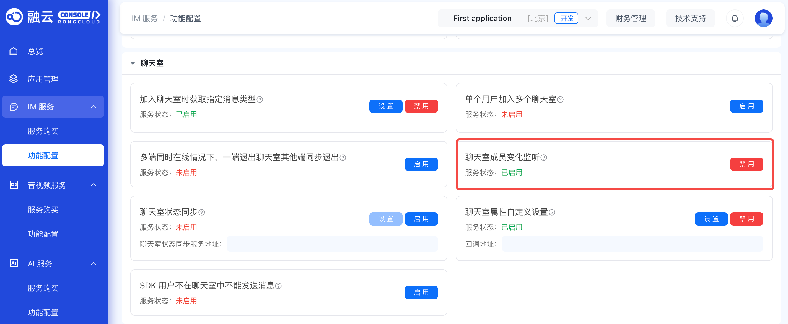

# 监听聊天室事件

聊天室业务为客户端 App 提供三种类型的事件监听器：**聊天室状态监听器、聊天室成员变化监听器、聊天室事件通知监听器**。通过这三个监听器，客户端 App 可以从融云服务端获取聊天室销毁状态、用户在当前及其他客户端加入退出聊天室的状态、聊天室中成员进出的事件通知、以及聊天室中成员禁言、封禁相关的信息。

#### 参数说明

| 监听器                           | 名称                 | 说明                                                                                       |
|----------------------------------|--------------------|------------------------------------------------------------------------------------------|
| [ChatRoomAdvancedActionListener] | 聊天室状态监听器     | 接收在当前客户端登录的用户加入、退出聊天室的事件与聊天室销毁状态的信息。                     |
| [ChatRoomMemberActionListener]   | 聊天室成员变化监听器 | 接收当前用户所在聊天室中其他用户加入、退出聊天室的信息。                                     |
| [ChatRoomNotifyEventListener]    | 聊天室事件通知监听器 | 接收当前所在聊天室中成员禁言、封禁相关的信息；接收当前用户在其他端加入、退出聊天室相关的信息。 |

## 监听聊天室状态

应用程序可以监听当前客户端上用户加入、退出聊天室的事件与聊天室销毁状态变更。

使用 `RongChatRoomClient` 的  `addChatRoomAdvanceActionListener` `setChatRoomAdvancedActionListener` 添加或设置 [ChatRoomAdvancedActionListener] 监听器。

#### 示例代码

```java
// addChatRoomAdvanceActionListener，since 5.2.5
RongChatRoomClient.addChatRoomAdvanceActionListener(
                new ChatRoomAdvancedActionListener() {
                    @Override
                    public void onJoining(String chatRoomId) {
                        // default implementation ignored
                    }

                    @Override
                    public void onJoined(String chatRoomId) {
                        // 加入聊天室成功，已废弃
                        // default implementation ignored
                    }

                    @Override
                    public void onJoined(String chatRoomId, JoinChatRoomResponse joinChatRoomResponse) {
                        // 加入聊天室成功 since 5.6.3
                        // default implementation ignored
                    }

                    @Override
                    public void onReset(String chatRoomId) {
                        // default implementation ignored
                    }

                    @Override
                    public void onQuited(String chatRoomId) {
                        // default implementation ignored
                    }

                    @Override
                    public void onDestroyed(String chatRoomId, ChatRoomDestroyType type) {
                        data.setFirstAndNotify(Pair.create(chatRoomId, type));
                    }

                    @Override
                    public void onError(String chatRoomId, CoreErrorCode code) {
                        // default implementation ignored
                    }
                });


// setChatRoomAdvanceActionListener
RongChatRoomClient.setChatRoomAdvanceActionListener(listener);
```

移除监听器：

#### 示例代码

```java
// removeChatRoomAdvanceActionListener，since 5.2.5
RongChatRoomClient.addChatRoomAdvanceActionListener(listener);
// setChatRoomAdvanceActionListener
RongChatRoomClient.setChatRoomAdvanceActionListener(null);
```

### 聊天室状态事件

下方列出了聊天室操作监听器 `ChatRoomAdvancedActionListener` 提供的事件列表及回调方法。

#### 参数说明

| 回调方法                                                                 | 触发时机                                | 说明                                                                                                                                                                     |
|--------------------------------------------------------------------------|-------------------------------------|------------------------------------------------------------------------------------------------------------------------------------------------------------------------|
| `onJoining(String chatRoomId)`                                           | 当前用户正在加入聊天室                  | 返回数据包括：聊天室 ID                                                                                                                                                   |
| `onJoined(String chatRoomId, JoinChatRoomResponse)` | 当前用户已加入聊天室（5.6.3 开始提供）。   | 返回数据包括：聊天室 ID，聊天室房间信息、用户在聊天室的状态。                                                                                                                |
| `onJoined(String chatRoomId)`                                            | 当前用户已加入聊天室（从 5.6.3 开始废弃） | 返回数据包括：聊天室 ID                                                                                                                                                   |
| `onReset(String chatRoomId)`                                             | 用户所在聊天室被重置。                   | 返回数据包括：聊天室 ID。注意，加入聊天室成功，但是聊天室被重置，接收到此回调后，还会立刻收到 `onJoining` 和 `onJoined` 回调。                                                  |
| `onQuited(String chatRoomId)`                                            | 当前用户退出聊天室                      | 返回数据包括：聊天室 ID                                                                                                                                                   |
| `onDestroyed(String chatRoomId, IRongCoreEnum.ChatRoomDestroyType type)` | 当前用户在线，且所在聊天室被销毁         | 返回数据包括：聊天室 ID、聊天室销毁类型。聊天室销毁类型为 `ChatRoomDestroyType.MANUAL`，表示主动调用 IM Server API 销毁聊天室。`ChatRoomDestroyType.AUTO` 表示聊天室自动销毁。 |
| `onError(String chatRoomId, IRongCoreEnum.CoreErrorCode code)`           | 聊天室操作异常                          | 返回数据包括：聊天室 ID、错误码。                                                                                                                                           |

## 监听聊天室成员变化

:::tip

 SDK 从 5.1.4 版本开始支持监听聊天室成员变化。
:::


从 5.1.4 版本，SDK 开始在 `RongChatRoomClient` 中提供 [ChatRoomMemberActionListener]，支持当前登录用户监听所在聊天室中其它成员的加入、退出行为。

### 开通服务

您可以在融云控制台，在 **IM 服务**>**功能配置**>**聊天室**>**聊天室成员变化监听**，开启此功能。开启后，用户加入、退出聊天室后，系统会使用消息的方式向聊天室中的其他成员发送回调通知，消息量会因此增加。



### 设置聊天室成员变化监听器

使用 [ChatRoomMemberActionListener] 方法设置聊天室成员变化监听器。从 5.6.7 版本 开始，新增返回 [ChatRoomMemberActionModel] 对象的回调方法，其中增加了当前聊天室人数。

#### 示例代码

```java
RongChatRoomClient.setChatRoomMemberListener(new RongChatRoomClient.ChatRoomMemberActionListener() {
    /**
     * @param chatRoomMemberActions
     * @param roomId
     */
    @Override
    public void onMemberChange(List<ChatRoomMemberAction> chatRoomMemberActions, String chatRoomId) {
        // Handle the member change with the list of ChatRoomMemberAction objects and the chatRoomId
    }

    /**
     * @since 5.6.7
     */
    @Override
    public void onMemberChange(ChatRoomMemberActionModel model) {
        // Handle the member change with the ChatRoomMemberActionModel object
        String chatroomId = model.getRoomId();
        List<ChatRoomMemberAction> chatRoomMemberActions = model.getChatRoomMemberActions();
        int memberCount = model.getMemberCount();

        for (ChatRoomMemberAction action : chatRoomMemberActions) {
            // Access the properties of ChatRoomMemberAction object
            String userId = action.getUserId();
            ChatRoomMemberAction.ChatRoomMemberActionType actionType = action.getChatRoomMemberAction();

            if (actionType == ChatRoomMemberAction.ChatRoomMemberActionType.CHAT_ROOM_MEMBER_JOIN) {
                            System.out.println("Action Type: Join");
                        } else if (actionType == ChatRoomMemberAction.ChatRoomMemberActionType.CHAT_ROOM_MEMBER_QUIT) {
                            System.out.println("Action Type: Leave");
                        }
        }
    }
});
```

聊天室中有其他用户加入或退出时，SDK 会同时触发两个 `onMemberChange` 回调方法，都在 UI 线程回调。[ChatRoomMemberAction] 列表中包含了当前聊天室中加入或退出聊天室的成员信息。[ChatRoomMemberActionModel] 额外封装了聊天室当前人数（指已加入未退出的人数）。推荐使用返回 `ChatRoomMemberActionModel` 对象的 `onMemberChange` 方法。

如果当前用户由于网络原因断开与融云的连接，退出聊天室，则无法监听到断开连接期间的其他成员的加入、退出行为。

## 监听聊天室事件通知

:::tip

 SDK 从 5.4.5 版本开始支持使用监听聊天室事件通知 [RCChatRoomNotifyEventListener] 方法。
:::


应用程序可以监听当前聊天室中成员禁言、封禁相关的通知，以及当前用户在其他端加入、退出聊天室相关的通知。

使用 `RongChatRoomClient` 的 `addChatRoomNotifyEventListener` 方法添加一个[ChatRoomNotifyEventListener] 监听器

#### 参数说明


| 回调方法                                                | 触发时机                                           | 说明                                                                                 |
|---------------------------------------------------------|------------------------------------------------|------------------------------------------------------------------------------------|
| onChatRoomNotifyMultiLoginSync(ChatRoomSyncEvent event) | 在用户在多端登录情况下，在其他客户端加入、退出聊天室 | 接收在当前客户端上用户加入、退出聊天室的事件                                          |
| onChatRoomNotifyBlock(ChatRoomMemberBlockEvent event)   | 用户所在聊天室中发生了禁言、解除禁言相关的事件      | 是否接收通知取决于调用服务端封禁、解封的相关 API 时是否指定了 `needNotify` 为 `true`。 |
| onChatRoomNotifyBan(ChatRoomMemberBanEvent event)       | 用户所在聊天室发生了封禁用户、解除封禁相关的事件    | 是否接收通知取决于调用服务端封禁、解封的相关 API 时是否指定了 `needNotify` 为 `true`。 |


#### 示例代码

```java
// Since 5.4.5
RongChatRoomClient.addChatRoomNotifyEventListener(
        new RongChatRoomClient.ChatRoomNotifyEventListener() {
            @Override
            public void onChatRoomNotifyMultiLoginSync(ChatRoomSyncEvent event) {

            }

            @Override
            public void onChatRoomNotifyBlock(ChatRoomMemberBlockEvent event) {

            }

            @Override
            public void onChatRoomNotifyBan(ChatRoomMemberBanEvent event) {

            }
        });

// Remove
RongChatRoomClient.removeChatRoomNotifyEventListener(listener);
```

### 多端登录事件通知

在用户在多端登录情况下，在其他客户端加入、退出聊天室时，触发 `onChatRoomNotifyMultiLoginSync(ChatRoomSyncEvent event)` 方法。

#### 参数说明

| 触发场景                                                            | 通知范围                          | 说明                                                                                                           |
|-----------------------------------------------------------------|-------------------------------|--------------------------------------------------------------------------------------------------------------|
| 用户多端登录，在一台设备上加入聊天室                                 | 当前加入的用户                    | 当前用户在一端加入聊天室时，其他端的在线设备上会接收通知，不在线的设备不会通知。返回数据包括：聊天室 ID、加入时间。  |
| 用户多端登录，在一台设备上退出聊天室                                 | 当前退出的用户                    | 当前用户在一端退出聊天室时，其他端的在线设备上会接收通知，不在线的设备不会通知。 返回数据包括：聊天室 ID、退出时间。 |
| 用户多端登录且已在聊天室中，加入一个新的聊天室导致被踢出上一个聊天室 | 当前用户，和被踢出的聊天室所有成员 | 如果在控制台开通了**单个用户加入多个聊天室**，则不会通知。返回数据包括：聊天室 ID、被踢出的时间。               |

`ChatRoomSyncEvent` 具体属性定义如下：

| 属性         | 类型                     | 说明                                                                                                                                                                               |
|--------------|--------------------------|----------------------------------------------------------------------------------------------------------------------------------------------------------------------------------|
| `chatroomId` | String                   | 聊天室 ID。                                                                                                                                                                         |
| `status`     | ChatRoomSyncStatus       | 变更的状态，`Quit(0)`：离开。`Join(1)`：加入。                                                                                                                                          |
| `reason`     | ChatRoomSyncStatusReason | 如果 `status` 是 `Quit` 的情况，区分离开类型：`LeaveOnMyOwn(1)` 表示自己主动离开。`OtherDeviceLogin(2)` 表示多端加入互踢导致离开。如果 `status` 为 `Join` 的情况，无需关心 `reason` 值。 |
| `time`       | long                     | 用户加入/退出/被踢的时间戳，精确到毫秒。                                                                                                                                             |
| `extra`      | String                   | 附加信息。                                                                                                                                                                          |

### 封禁相关事件通知

用户所在聊天室发生了封禁、解封的事件，且调用相关 Server API 时指定了需要通知（指定 `needNotify` 为 `true`），触发 `onChatRoomNotifyBlock(ChatRoomMemberBlockEvent event)` 方法。

#### 参数说明

| 触发场景                                          | 通知范围         | 说明                                                                       |
|-----------------------------------------------|--------------|--------------------------------------------------------------------------|
| [封禁聊天室用户][doc-page-封禁聊天室用户]         | 聊天室中所有成员 | 返回数据包括：聊天室 ID、被封禁成员用户 ID 列表、封禁时间与持续时长、附加信息。 |
| [解除封禁聊天室用户][doc-page-解除封禁聊天室用户] | 被解除封禁的成员 | 返回数据包括：聊天室 ID、当前用户 ID、附加信息。                               |

`ChatRoomMemberBlockEvent` 具体属性定义如下：

| 属性           | 类型                | 说明                                                                                                   |
|----------------|---------------------|------------------------------------------------------------------------------------------------------|
| `chatroomId`   | String              | 聊天室 ID。                                                                                             |
| `operateType`  | ChatRoomOperateType | 封禁类型。`Deblock(0)` ：解封。`Blocked(1)`：封禁。                                                         |
| `durationTime` | long                | 封禁时长，单位为毫秒，最大值为 43200分钟（1个月）, 最小值 1分钟。 `operateType` 为 `Blocked` 时，该字段有效。 |
| `operateTime`  | long                | 操作时间戳（毫秒）。                                                                                      |
| `userIdList`   | List\<String\>      | 被封禁的用户 ID 列表。解封时为当前用户 ID。                                                              |
| `extra`        | String              | 附加信息。                                                                                              |

### 禁言相关事件通知

用户所在聊天室发生了禁言、解除禁言相关的事件，且调用相关 Server API 时指定了需要通知（指定 `needNotify` 为 `true`），触发 `onChatRoomNotifyBan(ChatRoomMemberBanEvent event)` 方法。

#### 参数说明

| 触发场景                                                      | 通知范围             | 说明                                                                       |
|-----------------------------------------------------------|------------------|--------------------------------------------------------------------------|
| [禁言指定聊天室用户][doc-page-禁言指定聊天室用户]             | 聊天室中所有成员     | 返回数据包括：聊天室 ID、被封禁成员用户 ID 列表、禁言时间与持续时长、附加信息。 |
| [取消禁言指定聊天室用户][doc-page-取消禁言指定聊天室用户]     | 聊天室中所有成员     | 返回数据包括：聊天室 ID、被封禁成员用户 ID 列表、解除禁言时间、附加信息。       |
| [设置聊天室全体禁言][doc-page-设置聊天室全体禁言]             | 聊天室中所有成员     | 返回数据包括：聊天室 ID、禁言时间、附加信息。                                  |
| [取消聊天室全体禁言][doc-page-取消聊天室全体禁言]             | 聊天室中所有成员     | 返回数据包括：聊天室 ID、解除禁言时间、附加信息。                              |
| [加入聊天室全体禁言白名单][doc-page-加入聊天室全体禁言白名单] | 聊天室中所有成员     | 返回数据包括：聊天室 ID、被添加白名单的用户 ID 列表、设置白名单时间、附加信息。 |
| [移出聊天室全体禁言白名单][doc-page-移出聊天室全体禁言白名单] | 聊天室中所有成员     | 返回数据包括：聊天室 ID、被移出白名单的用户 ID 列表、移出白名单时间、附加信息。 |
| [全局禁言用户][doc-page-全局禁言用户]                         | 被全局禁言的用户     | 返回数据包括：聊天室 ID、禁言时间与持续时长、附加信息。                        |
| [取消全局禁言用户][doc-page-取消全局禁言用户]                 | 被解除全局禁言的用户 | 返回数据包括：聊天室 ID、解除禁言时间、附加信息。                              |

`ChatRoomMemberBanEvent` 具体属性定义如下：

| 属性           | 类型                    | 说明                                                                                           |
|----------------|-------------------------|----------------------------------------------------------------------------------------------|
| `chatroomId`   | String                  | 聊天室 ID。                                                                                     |
| `banType`      | [ChatRoomMemberBanType] | 聊天室禁言/解除禁言操作类型枚举                                                                |
| `durationTime` | long                    | 禁言时长，单位为毫秒：最大值为 43200 分钟（1个月），最小值1分钟。 `banType` 为禁言类型时，该字段有效。 |
| `operateTime`  | long                    | 操作时间戳（毫秒）。                                                                              |
| `userIdList`   | List\<String\>          | 被封禁的用户 ID 列表。解封时为当前用户 ID。                                                      |
| `extra`        | String                  | 附加信息。                                                                                      |

<!-- links -->
<!-- java doc -->
[RCChatRoomNotifyEventListener]: https://doc.rongcloud.cn/apidoc/chatroom-android/latest/zh_CN/html/-android--chatroom--s-d-k/io.rong.imlib.chatroom.base/-rong-chat-room-client/-chat-room-notify-event-listener/index.html
[ChatRoomMemberBanType]: https://doc.rongcloud.cn/apidoc/chatroom-android/latest/zh_CN/html/-android--chatroom--s-d-k/io.rong.imlib.model/-chat-room-member-ban-event/-chat-room-member-ban-type/index.html
[ChatRoomNotifyEventListener]: https://doc.rongcloud.cn/apidoc/chatroom-android/latest/zh_CN/html/-android--chatroom--s-d-k/io.rong.imlib.chatroom.base/-rong-chat-room-client/-chat-room-notify-event-listener/index.html
[ChatRoomMemberActionModel]: https://doc.rongcloud.cn/apidoc/chatroom-android/latest/zh_CN/html/-android--chatroom--s-d-k/io.rong.imlib.model/-chat-room-member-action-model/index.html
[ChatRoomAdvancedActionListener]: https://doc.rongcloud.cn/apidoc/chatroom-android/latest/zh_CN/html/-android--chatroom--s-d-k/io.rong.imlib.chatroom.base/-rong-chat-room-client/-chat-room-advanced-action-listener/index.html
[ChatRoomMemberActionListener]: https://doc.rongcloud.cn/apidoc/chatroom-android/latest/zh_CN/html/-android--chatroom--s-d-k/io.rong.imlib.chatroom.base/-rong-chat-room-client/-chat-room-member-action-listener/index.html
[ChatRoomMemberAction]: https://doc.rongcloud.cn/apidoc/chatroom-android/latest/zh_CN/html/-android--chatroom--s-d-k/io.rong.imlib.model/-chat-room-member-action/index.html
<!-- IM Server API links-->
[doc-page-封禁聊天室用户]: /platform-chat-api/chatroom/block/block-user
[doc-page-解除封禁聊天室用户]: /platform-chat-api/chatroom/block/unblock-user
[doc-page-禁言指定聊天室用户]: /platform-chat-api/chatroom/mute/gag-user
[doc-page-取消禁言指定聊天室用户]: /platform-chat-api/chatroom/mute/ungag-user
[doc-page-设置聊天室全体禁言]: /platform-chat-api/chatroom/mute/ban-chatroom
[doc-page-取消聊天室全体禁言]: /platform-chat-api/chatroom/mute/unban-chatroom
[doc-page-加入聊天室全体禁言白名单]: /platform-chat-api/chatroom/mute/add-to-chatroom-ban-whitelist
[doc-page-移出聊天室全体禁言白名单]: /platform-chat-api/chatroom/mute/remove-from-chatroom-ban-whitelist
[doc-page-全局禁言用户]: /platform-chat-api/chatroom/mute/gag-user-globally
[doc-page-取消全局禁言用户]: /platform-chat-api/chatroom/mute/ungag-user-globally

