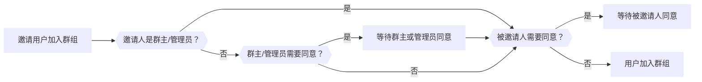

本文档旨在指导开发者如何使用融云即时通讯 Android IMLib SDK 实现主动加入群组、邀请用户加入群组、 用户同意或拒绝加入群组、 管理员同意或拒绝加群申请等功能。

:::tip
此功能从 5.12.0 版本开始支持。
:::

## 开通服务

信息托管服务已默认开通，您可以直接使用此功能。

## 加入群组管理

加入群组管理包含：主动加入群组、邀请加入群组、 用户同意或拒绝加入群组、 管理员同意或拒绝加群申请等功能。

### 主动加入群组

您可以调用 [joinGroup] 方法主动加入一个群组。

加入的结果受群组的加入权限 [joinPermission] 影响，有以下两种情况：

1. 群组的加入权限（[joinPermission]）为**需要群主/管理员审批**时，接口调用成功后 `IRongCoreEnum.CoreErrorCode` 会返回 `RC_GROUP_JOIN_GROUP_NEED_MANAGER_ACCEPT` ( 25424 )，表示需要等待群主或管理员的审批。同时本人和群主或管理员会都会收到 `onGroupApplicationEvent` 事件回调。
2. 群组的加入权限（[joinPermission]）为 “无需审批” 时，接口调用成功后 `IRongCoreEnum.CoreErrorCode` 会返回 `SUCCESS` ( 0 )，表示加入群组成功。同时本人和群内所有人会收到 `onGroupOperation` 事件回调，操作类型为 `Join`。

#### 代码示例
```java
// 群Id
String groupId = "groupId1";
RongCoreClient.getInstance().joinGroup(groupId, new IRongCoreCallback.ResultCallback<IRongCoreEnum.CoreErrorCode>() {
    @Override
    public void onSuccess(IRongCoreEnum.CoreErrorCode processCode) {
        // 加入群组请求成功
    }

    @Override
    public void onError(IRongCoreEnum.CoreErrorCode e) {
        // 加入群组请求失败
    }
});
```

### 邀请他人加入群组


此功能的使用受群组邀请角色权限 [invitePermission] 的影响，有权限的用户才可以调用 [inviteUsersToGroup] 方法邀请他人加入群组。


#### 代码示例
```java
// 群Id
String groupId = "groupId1";
// 用户ID列表
List<String> userIds = new ArrayList<>();
userIds.add("userId1");
userIds.add("userId2");
userIds.add("userId3");
RongCoreClient.getInstance().inviteUsersToGroup(groupId, userIds, new IRongCoreCallback.ResultCallback<IRongCoreEnum.CoreErrorCode>() {
    @Override
    public void onSuccess(IRongCoreEnum.CoreErrorCode processCode) {
        // 邀请加入群组请求成功
    }

    @Override
    public void onError(IRongCoreEnum.CoreErrorCode e) {
        // 邀请加入群组请求失败
    }
});
```

邀请用户加入群组的行为受到以下三方面的影响：
1. **加入权限**（ [joinPermission] ）：是否需要群主或管理员验证。
2. **邀请人角色**（ [role] ）：邀请人是群主或管理员，还是普通用户。
3. **被邀请人处理权限**（ [inviteHandlePermission] ）：是否需要被邀请人同意才能加入群组。



#### 具体规则

:::tip
下表中默认了群组的邀请权限 [invitePermission] 为 `Everyone`，即所有人都可以邀请他人加入群组。

开发中可以根据实际情况设置不同的权限。
:::

<table>
  <thead>
    <tr>
      <th><b>加入权限</b></th>
      <th><b>邀请人角色</b></th>
      <th><b>被邀请人审批</b></th>
      <th><b>事件流程</b></th>
    </tr>
  </thead>
  <tbody>
    <tr>
      <td rowspan="4">需要群主/管理员审批</td>
      <td rowspan="2">普通用户</td>
      <td>需要</td>
      <td><a href="#流程-a">流程 A</a></td>
    </tr>
    <tr>
      <td>不需要</td>
      <td><a href="#流程-b">流程 B</a></td>
    </tr>
    <tr>
      <td rowspan="2">群主或管理员</td>
      <td>需要</td>
      <td><a href="#流程-c">流程 C</a></td>
    </tr>
    <tr>
      <td>不需要</td>
      <td><a href="#流程-d">流程 D</a></td>
    </tr>
    <tr>
      <td rowspan="2">无需群主/管理员审批</td>
      <td rowspan="2">所有角色</td>
      <td>需要</td>
      <td><a href="#流程-c">流程 C</a></td>
    </tr>
    <tr>
      <td>不需要</td>
      <td><a href="#流程-d">流程 D</a></td>
    </tr>
  </tbody>
</table>

##### 事件流程如下

##### 流程 A
权限描述：
普通用户邀请他人，需要群主/管理员审批，需要被邀请人审批。

1. 发出邀请后，成功回调的 `IRongCoreEnum.CoreErrorCode` 返回 `RC_GROUP_JOIN_GROUP_NEED_MANAGER_ACCEPT` ( 25424 )，表示需要等待群主/管理员审批。邀请人和群主/管理员会收到 `onGroupApplicationEvent` 事件回调。
2. 群主/管理员同意后，邀请人、群主/管理员、被邀请人会收到 `onGroupApplicationEvent` 事件回调。
3. 被邀请人同意后，邀请人、群主/管理员、被邀请人会收到 `onGroupApplicationEvent` 事件回调。群内所有用户会收到群组操作 `onGroupOperation` 事件回调，操作类型为 `Join`。

##### 流程 B
权限描述：
- 普通用户邀请他人，需要群主/管理员审批，不需要被邀请人审批。

1. 发出邀请后，成功回调的 `IRongCoreEnum.CoreErrorCode` 返回 `RC_GROUP_JOIN_GROUP_NEED_MANAGER_ACCEPT` ( 25424 )，表示需要等待群主或管理员审批。邀请人和群主/管理员会收到 `onGroupApplicationEvent` 事件回调。
2. 群主或管理员同意后，被邀请人加入群组成功。邀请人、群主或管理员会收到 `onGroupApplicationEvent` 事件回调。群内所有用户会收到 `onGroupOperation` 事件回调，操作类型为 `Join`。

##### 流程 C
权限描述：
- 任意角色的用户（群主、管理员或普通用户）邀请他人，无需群主/管理员审批，需要被邀请人审批。

1. 发出邀请后，成功回调的 `IRongCoreEnum.CoreErrorCode` 返回 `RC_GROUP_NEED_INVITEE_ACCEPT` ( 25427 )，表示需要被邀请人同意后才能进入群组。邀请人和被邀请人会收到 `onGroupApplicationEvent` 事件回调。
2. 被邀请人同意后，邀请人和被邀请人会收到 `onGroupApplicationEvent` 事件回调。群内所有用户会收到 `onGroupOperation` 事件回调，操作类型为 `Join`。

##### 流程 D
权限描述：
- 群主/管理员邀请他人，需要群主/管理员审批，不需要被邀请人审批。
- 任意角色的用户（群主、管理员或普通用户）邀请他人，无需群主/管理员审批，不需要被邀请人审批。

1. 发出邀请后，成功回调的 `IRongCoreEnum.CoreErrorCode` 返回 `SUCCESS` ( 0 )，表示邀请成功。被邀请人会直接加入群组，群内所有用户会收到 `onGroupOperation` 事件回调，操作类型为 `Join`。

## 用户处理入群邀请

### 同意入群邀请

用户在收到入群邀请后，可以调用 [`acceptGroupInvite`](https://doc.rongcloud.cn/apidoc/imlibcore-android/latest/zh_CN/html/-android--i-m-lib-core--s-d-k/io.rong.imlib/-rong-core-client/index.html#-921034733%2FFunctions%2F1814687565) 方法同意加入群组。

#### 代码示例
```java
// 群Id
String groupId = "groupId1";
// 发出邀请的用户 ID
String inviterId = "userId1";
RongCoreClient.getInstance().acceptGroupInvite(groupId, inviterId, new IRongCoreCallback.OperationCallback() {
    @Override
    public void onSuccess() {
        // 用户同意加入群组成功
    }

    @Override
    public void onError(IRongCoreEnum.CoreErrorCode e) {
        // 用户同意加入群组失败
    }
});
```

### 拒绝入群邀请

用户在收到入群邀请后，可以调用 [`refuseGroupInvite`](https://doc.rongcloud.cn/apidoc/imlibcore-android/latest/zh_CN/html/-android--i-m-lib-core--s-d-k/io.rong.imlib/-rong-core-client/index.html#1769897879%2FFunctions%2F1814687565) 方法拒绝加入群组。

#### 代码示例
```java
// 群Id
String groupId = "groupId1";
// 发出邀请的用户 ID
String inviterId = "userId1";
// 拒绝原因
String reason = "拒绝原因";
RongCoreClient.getInstance().refuseGroupInvite(groupId, inviterId, reason, new IRongCoreCallback.OperationCallback() {
    @Override
    public void onSuccess() {
        // 用户拒绝加入群组成功
    }

    @Override
    public void onError(IRongCoreEnum.CoreErrorCode e) {
        // 用户拒绝加入群组失败
    }
});
```

## 群主或管理员处理入群申请

群申请处理有效期为 7 天，融云服务端最多存储 7 天的申请数据，超过 7 天后需要重新发起申请。

### 同意入群申请

群主或管理员在收到入群申请后，可以调用 [`acceptGroupApplication`](https://doc.rongcloud.cn/apidoc/imlibcore-android/latest/zh_CN/html/-android--i-m-lib-core--s-d-k/io.rong.imlib/-rong-core-client/index.html#781215723%2FFunctions%2F1814687565) 方法同意入群申请。

- 若处理的是用户主动加群申请，`applicantId` 传入群者 ID， `inviterId` 参数传 `null` 或空字符串 `""`。
- 若处理的是邀请加群申请，`applicantId` 传入群者 ID， `inviterId` 传入邀请人 ID。
- 群申请处理有效期为 7 天，融云服务端最多存储 7 天的请求数据，超过 7 天后需要重新发起请求。

#### 代码示例
```java
// 群Id
String groupId = "groupId1";
// 发出邀请的用户 ID
String inviterId = "userId1";
// 申请入群用户 ID
String applicantId = "userId2";
RongCoreClient.getInstance().acceptGroupApplication(groupId, inviterId, applicantId, new IRongCoreCallback.ResultCallback<IRongCoreEnum.CoreErrorCode>() {
    @Override
    public void onSuccess(IRongCoreEnum.CoreErrorCode errorCode) {
        // 同意加入群组请求成功
    }

    @Override
    public void onError(IRongCoreEnum.CoreErrorCode e) {
        // 同意加入群组请求失败
    }
});
```

接口调用成功后，回调中的 `IRongCoreEnum.CoreErrorCode` 受群组的被邀请人处理权限（[inviteHandlePermission]）影响，会有以下两种情况：
1. 需要被邀请人同意时，`IRongCoreEnum.CoreErrorCode` 会返回 `RC_GROUP_NEED_INVITEE_ACCEPT` ( 25427 )，表示需要被邀请人同意后才能进入群组。被邀请人会收到 `onGroupApplicationEvent` 事件回调。
2. 无需被邀请人同意时，`IRongCoreEnum.CoreErrorCode` 会返回 `SUCCESS` ( 0 )，表示被邀请者入群成功。群内所有用户会收到 `onGroupOperation` 加入群组类型事件回调。

### 拒绝入群申请

群主或管理员在收到入群申请后，可以调用 [`refuseGroupApplication`](https://doc.rongcloud.cn/apidoc/imlibcore-android/latest/zh_CN/html/-android--i-m-lib-core--s-d-k/io.rong.imlib/-rong-core-client/index.html#1844159770%2FFunctions%2F1814687565) 方法拒绝入群申请。

- 若处理的是用户主动加群申请，`applicantId` 传入群者 ID， `inviterId` 参数传 `null` 或空字符串 `""`。
- 若处理的是邀请加群申请，`applicantId` 传入群者 ID， `inviterId` 传入邀请人 ID。
- 群申请处理有效期为 7 天，融云服务端最多存储 7 天的请求数据，超过 7 天后需要重新发起请求。

#### 代码示例
```java
// 群Id
String groupId = "groupId1";
// 发出邀请的用户 ID
String inviterId = "userId1";
// 申请入群用户 ID
String applicantId = "userId2";
// 拒绝原因
String reason = "拒绝原因";
RongCoreClient.getInstance().refuseGroupApplication(groupId, inviterId, applicantId, reason, new IRongCoreCallback.OperationCallback() {
    @Override
    public void onSuccess() {
        // 拒绝加入群组请求成功
    }

    @Override
    public void onError(IRongCoreEnum.CoreErrorCode e) {
        // 拒绝加入群组请求失败
    }
});
```

## 分页获取群申请列表

您可以调用 [`getGroupApplications`](https://doc.rongcloud.cn/apidoc/imlibcore-android/latest/zh_CN/html/-android--i-m-lib-core--s-d-k/io.rong.imlib/-rong-core-client/index.html#590365162%2FFunctions%2F1814687565) 方法分页获取群申请列表。群申请处理有效期为 7 天，融云服务端最多存储 7 天的请求数据，超过 7 天后需要重新发起请求。

此接口不支持返回请求总数。

#### 代码示例
```java
{
    // ...
    // 分页拉取参数（设置null与设置""，效果等同）
    String pageToken = "";
    getGroupApplications(pageToken);
    // ...
}

public void getGroupApplications(String pageToken) {
    // 分页请求参数
    PagingQueryOption option = new PagingQueryOption();
    // 设置分页大小，取值范围为 [1~100]。
    option.setCount(20);
    // 分页拉取参数
    option.setPageToken(pageToken);
    // 按操作时间正序、倒序获取。true：正序；false：倒序。
    option.setOrder(false);
    // 查询发出的申请 + 收到的申请类型的请求
    GroupApplicationDirection[] directions = new GroupApplicationDirection[]{GroupApplicationDirection.ApplicationSent, GroupApplicationDirection.ApplicationReceived};
    // 查询管理员待处理 + 管理员拒绝 + 已加入类型的申请
    GroupApplicationStatus[] status = new GroupApplicationStatus[]{GroupApplicationStatus.ManagerUnHandled, GroupApplicationStatus.ManagerRefused,  GroupApplicationStatus.Joined};
    RongCoreClient.getInstance().getGroupApplications(option, directions, status, new IRongCoreCallback.PageResultCallback<GroupApplicationInfo>() {
        @Override
        public void onSuccess(PagingQueryResult<GroupApplicationInfo> result) {
            if (!TextUtils.isEmpty(result.getPageToken())) {
                // 使用返回的 pageToken 拉取下一页
                getGroupApplications(result.getPageToken());
            } else {
                // 拉取结束
            }
        }

        @Override
        public void onError(IRongCoreEnum.CoreErrorCode e) {
            // 拉取失败
        }
    });
}
```

<!-- links -->
[joinPermission]: https://doc.rongcloud.cn/apidoc/imlibcore-android/latest/zh_CN/html/-android--i-m-lib-core--s-d-k/io.rong.imlib.model/-group-info/index.html#-1387522049%2FProperties%2F1814687565
[inviteUsersToGroup]:https://doc.rongcloud.cn/apidoc/imlibcore-android/latest/zh_CN/html/-android--i-m-lib-core--s-d-k/io.rong.imlib/-rong-core-client/invite-users-to-group.html
[joinGroup]:https://doc.rongcloud.cn/apidoc/imlibcore-android/latest/zh_CN/html/-android--i-m-lib-core--s-d-k/io.rong.imlib/-rong-core-client/join-group.html
[invitePermission]: https://doc.rongcloud.cn/apidoc/imlibcore-android/latest/zh_CN/html/-android--i-m-lib-core--s-d-k/io.rong.imlib.model/-group-info/index.html#1179713280%2FProperties%2F1814687565
[inviteHandlePermission]: https://doc.rongcloud.cn/apidoc/imlibcore-android/latest/zh_CN/html/-android--i-m-lib-core--s-d-k/io.rong.imlib.model/-group-info/index.html#1298709048%2FProperties%2F1814687565
[role]: https://doc.rongcloud.cn/apidoc/imlibcore-android/latest/zh_CN/html/-android--i-m-lib-core--s-d-k/io.rong.imlib.model/-group-info/index.html#-881841534%2FProperties%2F1814687565
