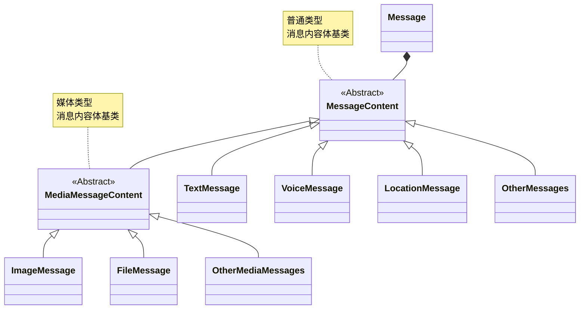

# 消息介绍

IMLib SDK 定义了 [Message] 类，用于进行消息传输和管理。

## Message 模型

[Message] 类中封装了以下关键数据：

- **用于消息传输的属性**：发送者 ID、接收者 ID、所属会话类型等。
- **消息内容体**： 用于封装一条消息携带的具体内容，分为普通消息内容体和媒体消息内容体。例如，文本消息内容（[TextMessage]）属于普通消息内容体，图片消息内容（[ImageMessage]）属于媒体消息内容体。消息内容体的类型，常称为「消息类型」，决定了使用发送普通消息还是发送媒体的接口。

:::tip

 文档里出现的「消息」，如文本消息、语音消息等，有时指继承自 `MessageContent` 或 `MediaMessageContent` 的消息具体内容。
:::

下表描述 [Message] 类的关键属性，完整的属性列表可参考 API 文档。

| 属性名                | 类型                  | 描述                                                                                                                                                                                                                                                                                       |
|:----------------------|:----------------------|:-----------------------------------------------------------------------------------------------------------------------------------------------------------------------------------------------------------------------------------------------------------------------------------------|
| ObjectName            | String                | 消息类型的标识名，由消息内容体中的 `io.rong.imlib.MessageTag` 注解中的 value 值决定。                                                                                                                                                                                                                             |
| Content               | [MessageContent]      | 消息携带的具体内容，必须为 [MessageContent] 或 [MediaMessageContent] 的子类对象，其中封装了不同类型消息的具体数据字段。即时通讯服务已提供预定义的消息类型，并规定了跨平台一致的消息内容体结构（参见[消息类型概述]），如文本、语音、图片、GIF 等。您也可以通过自定义消息内容体创建自定义消息类型。                                                                                                                 |
| ConversationType      | [ConversationType]    | 会话类型枚举，例如单聊、群聊、<!--public-cloud-only start-->聊天室、超级群、<!--public-cloud-only end-->系统会话等。参考[会话介绍](../conversation/intro.md)。                                                                                                                                                               |
| SenderUserId          | String                | 消息发送者的用户 ID。                                                                                                                                                                                                                                                                             |
| TargetId              | String                | 会话 ID（或称目标 ID），用于标识会话对端。<ol><li>针对单聊会话，用对端用户的 ID 作为 Target ID，因此发送与接收的所有消息的 Target ID 一定为对端的用户 ID。**请注意**，本端用户所接收的消息在本地消息数据中存储的 Target ID 也不是当前用户 ID，而是对端用户（消息发送者）的用户 ID。</li><li>在群组、聊天室、超级群会话中，Target ID 为对应的群组、聊天室、超级群 ID。</li><li>针对系统会话，因客户端用户无法回复系统会话消息，因此不需要 Target ID。</li></ol> | <!--public-cloud-only start-->
| ChannelId             | String                | 超级群频道 ID。                                                                                                                                                                                                                                                                                | <!--public-cloud-only end-->
| MessageId             | int                   | 消息 ID，消息在本地存储中的唯一 ID（数据库索引唯一值）。                                                                                                                                                                                                                                                          |
| UId                   | String                | 消息 UID，在同一个  App Key 下全局唯一。只有发送成功的消息才有唯一 ID。                                                                                                                                                                                                                                             |
| MessageDirection      | [MessageDirection]    | 消息方向枚举，分为发送和接收。                                                                                                                                                                                                                                                                          |
| SentTime              | long                  | 消息发送时间。发送时间为消息从发送客户端到达服务器时服务器的本地时间。使用 UNIX 时间戳，单位为毫秒。                                                                                                                                                                                                                                    |
| ReceivedTime          | long                  | 消息接收时间。接收时间为消息到达接收客户端时客户端的本地时间。使用 UNIX 时间戳，单位为毫秒。                                                                                                                                                                                                                                        |
| SentStatus            | [SentStatus]          | 发送消息的状态。如发送中、发送成功、发送失败、取消发送。                                                                                                                                                                                                                                                             |
| ReceivedStatus        | [ReceivedStatus]      | 接收到的消息的状态，如是否已读、是否下载等。详见[消息接收状态](./receive.md#消息接收状态)。                                                                                                                                                                                                                                   |
| ReadReceiptInfo       | [ReadReceiptInfo]     | 群聊消息已读回执信息。详细请参考[群聊消息回执](./read-receipt-1v1-group.md)。                                                                                                                                                                                                                                   |
| isCanIncludeExpansion | boolean               | 是否允许消息扩展。详情请参考 [消息扩展](./expansion.md)。                                                                                                                                                                                                                                                   |
| Expansion             | `Map<String, String>` | 消息扩展信息。详情请参考 [消息扩展](./expansion.md)。                                                                                                                                                                                                                                                     |
| Extra                 | String                | 消息的附加信息，该字段为本地操作的字段，不会发往服务端。请区别于 `MessageContent.extra`，后者会随消息一并发送到对端。                                                                                                                                                                                                                   |
| isOffline             | boolean               | 是否是离线消息，只在接收消息的回调方法中有效，如果消息为离线消息，则为 true ，其他情况均为 false。该属性在 SDK 5.4.4 版本开始支持。                                                                                                                                                                                                            |
| disableUpdateLastMessage             | boolean | 禁止更新到会话最新一条消息，默认 false:更新 true:不更新。该属性在 SDK 5.12.2 版本开始支持。                                                                                                                                                                                                                           |
| needReceipt | boolean | 消息已读回执操作标识。该属性在 SDK 5.20.0 版本开始支持。详细请参考[逐条消息已读功能](./read-receipt-v5.md)。 |
| sentReceipt | boolean | 已读回执是否已发送。该属性在 SDK 5.20.0 版本开始支持。详细请参考[逐条消息已读功能](./read-receipt-v5.md)。 |
| modifyInfo | MessageModifyInfo | 消息修改信息。该属性在 SDK 5.26.0 版本开始支持。详细请参考[消息修改](./modify_message.md)。 |

## MessageContent {#messagecontent}

`Message` 类中封装了 `content` 属性，代表一条消息携带的具体内容。消息内容体的类型必须继承以下基类：

- [MessageContent] - 即普通消息内容体。例如，SDK 内置消息类型中的文本消息内容体（[TextMessage]）即继承自 `MessageContent`。
- [MediaMessageContent] - 即媒体消息内容体，继承自 `MessageContent` 基类，并在其基础上增加了对媒体文件的处理逻辑。。例如，SDK 内置消息类型中的文本消息内容体（[ImageMessage]）即继承自 `MediaMessageContent`。在发送和接收消息时，SDK 会判断消息类型是否为媒体类型消息，如果是媒体类型，则会触发上传或下载媒体文件流程。

即时通讯服务已提供预定义的、跨平台一致的消息内容体结构（参见[消息类型概述]），如文本、语音、图片、GIF 等。如果您需要实现自定义消息，可以继承 [MessageContent] 或 [MediaMessageContent]，创建自定义消息内容体。

## 消息存储策略 {#messagetag}

客户端 SDK 和即时通讯服务端通过消息注解（`MessageTag`）识别消息的类型、在本地和服务端的存储策略、是否计入未读消息数等属性。`MessageTag` 是基于 Java annotation 实现的、对消息内容类添加的注释。继承自 `MessageContent` 或 `MediaMessageContent` 的消息具体内容都必须带有 `MessageTag` 注解。

如果发送 SDK 内置消息类型的消息，则 `MessageTag` 默认自动添加，无需额外操作。

如果您需要创建自定义消息类型，则需要了解学习如何正确创建消息注解。详见以下文档：

- [自定义消息类型](./customize.md)
- [自定义消息类型（旧版）](./customize.md)

<!-- 链接区域 -->
[消息类型概述]: /platform-chat-api/message-about/about-message-types
[Message]: https://doc.rongcloud.cn/apidoc/imlibcore-android/latest/zh_CN/html/-android--i-m-lib-core--s-d-k/io.rong.imlib.model/-message/index.html
[TextMessage]: https://doc.rongcloud.cn/apidoc/imlibcore-android/latest/zh_CN/html/-android--i-m-lib-core--s-d-k/io.rong.message/-text-message/
[ImageMessage]: https://doc.rongcloud.cn/apidoc/imlibcore-android/latest/zh_CN/html/-android--i-m-lib-core--s-d-k/io.rong.message/-image-message/
[LocationMessage]: https://www.rongcloud.cn/docs/api/android/im_v5/latest/location/io/rong/imlib/location/message/LocationMessage.html
[MessageTag]: https://doc.rongcloud.cn/apidoc/imlibcore-android/latest/zh_CN/html/-android--i-m-lib-core--s-d-k/io.rong.imlib/-message-tag/index.html
[MessageContent]: https://doc.rongcloud.cn/apidoc/imlibcore-android/latest/zh_CN/html/-android--i-m-lib-core--s-d-k/io.rong.imlib.model/-message-content/
[MediaMessageContent]: https://doc.rongcloud.cn/apidoc/imlibcore-android/latest/zh_CN/html/-android--i-m-lib-core--s-d-k/io.rong.message/MediaMessageContent.html
[ConversationType]: https://doc.rongcloud.cn/apidoc/imlibcore-android/latest/zh_CN/html/-android--i-m-lib-core--s-d-k/io.rong.imlib.model/-conversation/-conversation-type/index.html
[MessageDirection]: https://doc.rongcloud.cn/apidoc/imlibcore-android/latest/zh_CN/html/-android--i-m-lib-core--s-d-k/io.rong.imlib.model/-message/-message-direction/index.html
[SentStatus]: https://doc.rongcloud.cn/apidoc/imlibcore-android/latest/zh_CN/html/-android--i-m-lib-core--s-d-k/io.rong.imlib.model/-message/-sent-status/index.html
[ReceivedStatus]: https://doc.rongcloud.cn/apidoc/imlibcore-android/latest/zh_CN/html/-android--i-m-lib-core--s-d-k/io.rong.imlib.model/-message/-received-status/index.html
[ReadReceiptInfo]: https://doc.rongcloud.cn/apidoc/imlibcore-android/latest/zh_CN/html/-android--i-m-lib-core--s-d-k/io.rong.imlib.model/-read-receipt-info/index.html

