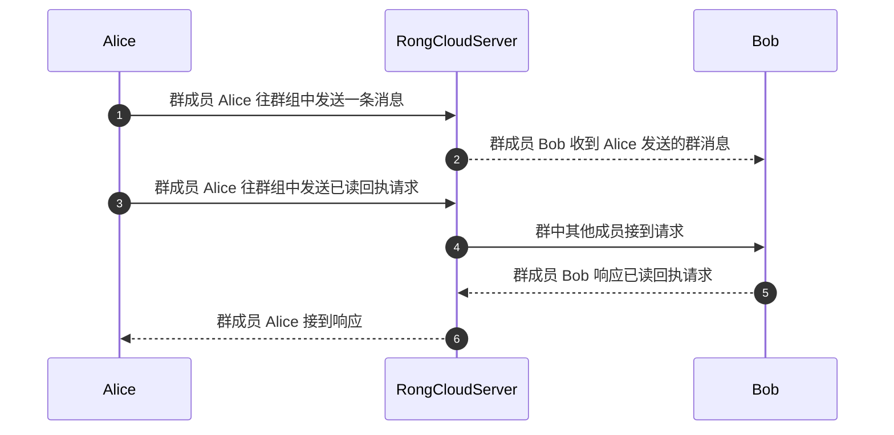

# 单群聊已读回执

:::important 重要提示
- 自 2025.11.25 起，新建的 App Key 且 SDK 版本 ≥ 5.20.0 时，默认使用[逐条消息已读功能（消息已读 V5）](/android-imlib/message/read-receipt-v5)，不再使用本功能。
- 如果 SDK 版本 < 5.20.0，默认使用本功能（单群聊已读回执），因为该版本尚未支持逐条消息已读功能。
- 如果 SDK 版本 ≥ 5.20.0 但需要使用本功能，请[提交工单](https://console.rongcloud.cn/agile/formwork/ticket/create)申请切换。
:::

已读回执功能可以让发送方知道消息是否被对方已读。

- 在单聊场景下，当接收方已读消息后，可以主动发送已读回执给发送方，发送方通过监听已读回执消息来获得已读通知。
- 在群聊场景下，当一条消息发送到群组后，发送方可以在消息发送完成后主动发起已读回执请求。群组中的其他成员在读到这条消息后，可以对请求进行响应。发送方通过监听已读回执响应结果来获知哪些群成员已读了这条消息。

SDK 提供了一个已读回执监听器 [ReadReceiptListener]，用于处理单聊、群聊已读回执相关的事件通知。

## 单聊已读回执

单聊已读功能需要消息接收方将阅读消息的时间戳传递给消息发送方，消息发送方通过该时间戳获取对应的阅读进度。IMLib SDK 定义了（[SentStatus]），用于记录单聊会话中的一条消息是否已被对方阅读，您可以通过获取本端发出的消息的发送状态（`sentStatus`）属性查询具体阅读的状态。

### 发送单聊已读回执

消息接收方在阅读过某条消息后，需要调用 [sendReadReceiptMessage] 方法传入一个时间戳，主动发送已读回执给消息发送方。可以传入指定消息的发送时间 `message.getSentTime()`），或者传入会话最后一条消息的发送时间（`conversation.getSentTime()`）。单聊已读回执实际是一条已读通知消息，由 SDK 内部构建并发出

#### 示例代码

```java
ConversationType conversationType = ConversationType.PRIVATE;
String targetId = "接收回执方的用户 ID ";
long timestamp = message.getSentTime();// 接收的消息的发送时间

RongCoreClient.getInstance().sendReadReceiptMessage(conversationType, targetId, timestamp, new IRongCoreCallback.ISendMessageCallback() {

        @Override
        public void onAttached(Message message) {

        }

        @Override
        public void onSuccess(Message message) {

        }

        @Override
        public void onError(Message message, IRongCoreEnum.CoreErrorCode CoreErrorCode) {

        }
    });

```

### 接收单聊已读回执

发送方需要使用 [setReadReceiptListener] 设置已读回执监听器，才能在收到单聊已读回执时收到通知。IMLib SDK 收到单聊消息的已读回执后，会读取其中携带的时间戳，将本地消息数据库中该单聊会话的早于该时间戳的所有消息的 [SentStatus] 属性改为 `READ`，同时触发 [ReadReceiptListener] 的 `onReadReceiptReceived` 方法收取到该类通知。

#### 示例代码

```java
RongCoreClient.setReadReceiptListener(new IRongCoreListener.ReadReceiptListener() {

    @Override
    public void onReadReceiptReceived(final Message message) {
        // 此处为单聊消息回执回调方法，可在这做回执消息处理
        Long timestamp = message.getContent().getLastMessageSendTime();
    }
    @Override
    public void onMessageReceiptRequest(Conversation.ConversationType type, String targetId, String messageUId) {
        // 此处为群聊, 消息回执请求消息回调方法
    }

    @Override
    public void onMessageReceiptResponse(Conversation.ConversationType type, String targetId, String messageUId, HashMap<String, Long> respondUserIdList) {
        // 此处为群聊, 消息回执响应消息回调方法
    }
});
```

应用程序可以从 `onReadReceiptReceived` 方法中获取 `Message` 对象，并从其 `content` 属性中的消息内容体对象 [ReadReceiptMessage] 中获取其携带的时间戳。在 UI 展示本端已发送的消息时，可以将早于该时间戳的消息均展示为对方已读。

## 群聊已读回执

群聊已读回执功能基于消息的全局唯一 ID（messageUId）。通过在群聊会话中传递消息的 messageUId，消息发送者可获得一条指定消息的阅读进度和已读用户列表。SDK 定义了 [ReadReceiptInfo]，用于记录群聊会话中的一条消息群组已读回执数据，应用程序可以通过获取本端发出的消息的 [ReadReceiptInfo] 属性查询具体状态。

群聊已读回执的工作流程如下：



1. 群成员 Alice 往群组发送了一条消息。消息将到达即时通讯服务端，并由即时通讯服务端发送到目标群组中。
1. Alice 希望得知已阅读该条消息的群成员列表。作为该条消息的发送者，她可以发起群组消息已读回执请求。
1. 群组中其他成员监听到 Alice 发起的群消息已读回执请求。
1. 群成员 Bob 阅读了 Alice 发送的群消息，于是在群组中响应 Alice 的已读回执请求。
1. 作为消息发送者，Alice 可以通过监听接收该条消息的已读回执响应。收到 Bob 在群组中发送的响应后，即可调整消息已读数。

### 发起群聊已读回执请求

发送者向群组中发送消息后，必须先主动发起已读回执请求，获取群成员的主动响应，才能获取该条消息的阅读状态。在一个群组会话中，只有消息发送者可以发起群聊已读回执请求。

消息发送完成后，消息发送者使用 [sendReadReceiptRequest] 方法，传入已发送的 [Message] 对象，对这条消息发起已读回执请求，SDK 内部会构建并发出一条群聊已读回执请求消息。

#### 示例代码

```java
RongCoreClient.getInstance().sendReadReceiptRequest(message, new IRongCoreCallback.OperationCallback(){
    @Override
    public void onSuccess() {
    }

    @Override
    public void onError(IRongCoreEnum.CoreErrorCode errorCode) {
    }
});
```

### 接收群聊已读回执请求

群组成员均需要使用 [setReadReceiptListener] 设置已读回执监听器，才能接收到群组内的已读回执请求。在任意群成员发起已读回执请求后，其他群成员会通过 [ReadReceiptListener] 的 `onMessageReceiptRequest` 回调收到已读回执请求。

```java

    @Override
    public void onMessageReceiptRequest(Conversation.ConversationType type, String targetId, String messageUId) {
        // 收到群聊消息已读回执请求
    }

```

`onMessageReceiptRequest` 方法中会返回消息的 UID，您可以通过 [getMessageByUid] 方法获取消息对象，用于后续响应已读回执请求。如果需要批量获取消息，可以使用 `ChannelClient` 下的 [getBatchLocalMessages] 方法。

### 响应群聊已读回执请求

消息接收者可以根据用户的阅读进度，对已读回执请求进行响应。如果一次接收到多个请求，可以批量响应已读回执请求，但一次只能批量响应同一个会话中的已读回执请求。

消息接收者可以使用 [sendReadReceiptResponse] 方法，传入会话类型、群组 ID 和 [Message] 对象列表，发起已读回执响应。注意会话类型一定是 `ConversationType.GROUP`。

#### 示例代码

```java
Conversation.ConversationType conversationType = ConversationType.GROUP;
String targetId = "群 ID";
List<Message> messageList = new ArrayList<>();
messageList.add(message1);

RongCoreClient.getInstance().sendReadReceiptResponse(conversationType, targetId, messageList, new IRongCoreCallback.OperationCallback() {

    public void onSuccess() {
    }

    @Override
    public void onError(IRongCoreEnum.CoreErrorCode coreErrorCode) {
    }
});
```

### 接收群聊已读回执响应

群组内有用户响应成功后，请求发起方会通过 [ReadReceiptListener] 的 `onMessageReceiptResponse` 收到通知及响应结果。注意只有请求发起者可以收到响应。

#### 示例代码

```java

    @Override
    public void onMessageReceiptResponse(Conversation.ConversationType type, String targetId, String messageUId, HashMap<String, Long> respondUserIdList) {
        // 收到对群聊已读回执请求的响应

    }

```

应用程序可以从 `onMessageReceiptResponse` 方法中获取消息的 UID 和所有已响应的用户列表。在 UI 展示本端发送的该条消息时，可以展示已读人数和具体的已读用户列表。SDK 会在消息的（[ReadReceiptInfo]）属性中存储该条群聊消息的已读回执数据。

<!-- api links -->
[ReadReceiptListener]: https://doc.rongcloud.cn/apidoc/imlibcore-android/latest/zh_CN/html/-android--i-m-lib-core--s-d-k/io.rong.imlib/-i-rong-core-listener/-read-receipt-listener/index.html
[Message]: https://doc.rongcloud.cn/apidoc/imlibcore-android/latest/zh_CN/html/-android--i-m-lib-core--s-d-k/io.rong.imlib.model/-message/index.html
[ConversationType]: https://doc.rongcloud.cn/apidoc/imlibcore-android/latest/zh_CN/html/-android--i-m-lib-core--s-d-k/io.rong.imlib.model/-conversation/-conversation-type/index.html
[sendReadReceiptMessage]: https://doc.rongcloud.cn/apidoc/imlibcore-android/latest/zh_CN/html/-android--i-m-lib-core--s-d-k/io.rong.imlib/-rong-core-client/send-read-receipt-message.html
[setReadReceiptListener]: https://doc.rongcloud.cn/apidoc/imlibcore-android/latest/zh_CN/html/-android--i-m-lib-core--s-d-k/io.rong.imlib/-rong-core-client/set-read-receipt-listener.html
[SentStatus]: https://doc.rongcloud.cn/apidoc/imlibcore-android/latest/zh_CN/html/-android--i-m-lib-core--s-d-k/io.rong.imlib.model/-message/-sent-status/index.html
[getSentTime]: https://doc.rongcloud.cn/apidoc/imlibcore-android/latest/zh_CN/html/-android--i-m-lib-core--s-d-k/io.rong.imlib.model/-conversation/get-sent-time.html
[ReadReceiptMessage]: https://doc.rongcloud.cn/apidoc/imlibcore-android/latest/zh_CN/html/-android--i-m-lib-core--s-d-k/io.rong.message/-read-receipt-message/index.html
[sendReadReceiptRequest]: https://doc.rongcloud.cn/apidoc/imlibcore-android/latest/zh_CN/html/-android--i-m-lib-core--s-d-k/io.rong.imlib/-rong-core-client/send-read-receipt-request.html
[ReadReceiptInfo]: https://doc.rongcloud.cn/apidoc/imlibcore-android/latest/zh_CN/html/-android--i-m-lib-core--s-d-k/io.rong.imlib.model/-read-receipt-info/index.html
[sendReadReceiptResponse]: https://doc.rongcloud.cn/apidoc/imlibcore-android/latest/zh_CN/html/-android--i-m-lib-core--s-d-k/io.rong.imlib/-rong-core-client/send-read-receipt-response.html
[getMessageByUid]: https://doc.rongcloud.cn/apidoc/imlibcore-android/latest/zh_CN/html/-android--i-m-lib-core--s-d-k/io.rong.imlib/-rong-core-client/get-message-by-uid.html
[getBatchLocalMessages]: https://doc.rongcloud.cn/apidoc/imlibcore-android/latest/zh_CN/html/-android--i-m-lib-core--s-d-k/io.rong.imlib/-channel-client/get-batch-local-messages.html

