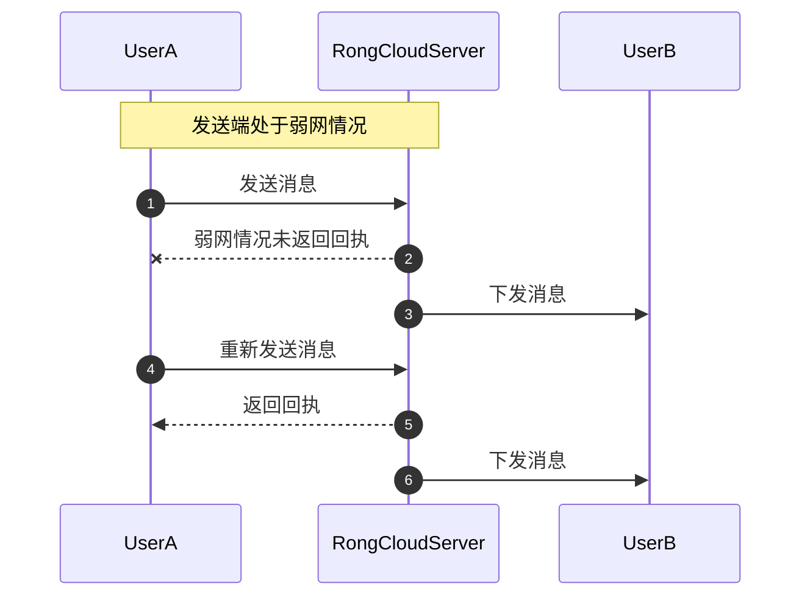

# 接收消息

开发者拦截 SDK 接收的消息，并进行相应的业务操作。

## 监听消息接收

应用程序可以通过 [addOnReceiveMessageListener] 方法设置多个消息接收监听器。所有接收到的消息都会在 [OnReceiveMessageWrapperListener] 监听器的方法中回调。建议在应用生命周期内注册消息监听。

```java
RongCoreClient.addOnReceiveMessageListener(
        new io.rong.imlib.listener.OnReceiveMessageWrapperListener() {
            @Override
            public boolean onReceivedMessage(Message message, ReceivedProfile profile) {
            int left = profile.getLeft();
            boolean isOffline = profile.isOffline();
            boolean hasPackage = profile.hasPackage();
            }
});
```

消息接收监听器 [OnReceiveMessageWrapperListener]，可接收实时消息或离线消息。

当客户端连接成功后，服务端会将所有离线消息<sup><a href="/guides/glossary/imglossary#offline">?</a></sup>以消息包（Package）的形式下发给客户端，每个 Package 中最多含 200 条消息。客户端会解析 Package 中的消息，逐条上抛并通知应用。

SDK 接收到消息时会触发以下方法。

```java
public abstract void onReceivedMessage(Message message, ReceivedProfile profile);
```

`ReceivedProfile` 中封装了当前与接收消息相关的数据：

- `ReceivedProfile` 中的 `left` 为当前正在解析的消息包（Package）中还剩余的消息条数。
- `ReceivedProfile` 中的 `hasPackage` 表示当前是否在服务端还存在未下发的消息包（Package）。
- `ReceivedProfile` 中的 `offline` 表示当前消息是否为离线消息。

同时满足以下条件，表示离线消息已收取完毕：

- `hasPackage` 为 `false`：表示当前正在解析最后一包消息。
- `left` 为 0：表示最后一个消息包中最后一条消息已接收完毕。

从 5.2.3 版本开始，每次连接成功后，离线消息收取完毕时会触发以下回调方法。如果没有离线消息，连接成功后会立即触发。

```java
public void onOfflineMessageSyncCompleted() {
    //
}
```

为了避免内存泄露，请在不需要监听时调用 [removeOnReceiveMessageListener] 移除监听器。

```java
RongCoreClient.removeOnReceiveMessageListener(listener);
```

## 消息接收状态

[Message] 类中封装了 [ReceivedStatus]，使用了以下状态表示接收到的消息的状态。

| 状态| 描述 |
|---|---|
|`isRead()`  | 是否已读。如果消息在当前设备上被阅读，该状态会变为已读。SDK 5.6.8 版本开始，只要在其他设备上阅读过该消息，当前设备的该状态值会也变为已读。|
|`isListened()` | 是否已被收听，仅用于语音消息。|
|`isDownload()`| 是否已被下载，仅适用于媒体消息。 |
|`isRetrieved()`| 该消息是否已被同时在线或之前登录的其他设备接收。只要其他设备先收到该消息，该状态值都会变为已接收。|

## 禁用消息排重机制

消息排重机制会在 SDK 接收单聊、群聊、系统消息、聊天室时自动去除内容重复消息。当 App 本地存在大量消息，SDK 默认的排重机制可能会因性能问题导致收消息卡顿。因此在接收消息发生卡顿问题时，可尝试关闭 SDK 的排重机制。

### 为什么接收消息可能出现消息重复

发送端处于弱网情况下可能出现该问题。A 向 B 发送消息后，消息成功到达服务端，并成功下发到接收者 B。但 A 由于网络等原因可能未收到服务端返回的 ack，导致 A 认为没有发送成功。此时如果 A 重发消息，此时 B 就会收到与之前重复的消息（消息内容相同，但 Message UID 不同）。



### 关闭消息排重

:::tip

 SDK 从 5.3.4 版本开始支持关闭消息排重。仅在 [RongCoreClient](https://doc.rongcloud.cn/apidoc/imlibcore-android/latest/zh_CN/html/-android--i-m-lib-core--s-d-k/io.rong.imlib/-rong-core-client/index.html) 中提供该接口。不支持为聊天室、超级群会话类型关闭消息排重。
:::


请在 SDK 初始化之后，建立 IM 连接之前调用。多次调用以最后一次为准。

```java
boolean enableCheck = false // 关闭消息排重
RongCoreClient.getInstance().setCheckDuplicateMessage(enableCheck)
```

> 聊天室消息从 5.8.2 版本开始支持关闭消息排重。在 `RongChatRoomClient` 中提供。

请在 SDK 初始化之后，建立 IM 连接之前调用。多次调用以最后一次为准。

```java
boolean enableCheck = false // 关闭消息排重
RongChatRoomClient.getInstance().setCheckChatRoomDuplicateMessage(enableCheck)
```

<!-- api links-->
[OnReceiveMessageWrapperListener]: https://doc.rongcloud.cn/apidoc/imlibcore-android/latest/zh_CN/html/-android--i-m-lib-core--s-d-k/io.rong.imlib.listener/-on-receive-message-wrapper-listener/index.html
[Message]: https://doc.rongcloud.cn/apidoc/imlibcore-android/latest/zh_CN/html/-android--i-m-lib-core--s-d-k/io.rong.imlib.model/-message/index.html
[addOnReceiveMessageListener]: https://doc.rongcloud.cn/apidoc/imlibcore-android/latest/zh_CN/html/-android--i-m-lib-core--s-d-k/io.rong.imlib/-rong-core-client/add-on-receive-message-listener.html
[removeOnReceiveMessageListener]: https://doc.rongcloud.cn/apidoc/imlibcore-android/latest/zh_CN/html/-android--i-m-lib-core--s-d-k/io.rong.imlib/-rong-core-client/remove-on-receive-message-listener.html
[ReceivedStatus]: https://doc.rongcloud.cn/apidoc/imlibcore-android/latest/zh_CN/html/-android--i-m-lib-core--s-d-k/io.rong.imlib.model/-message/-received-status/index.html

