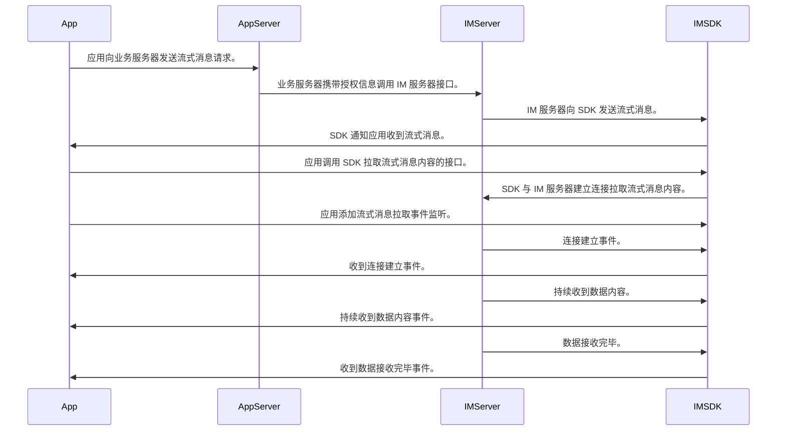

本文主要描述了如何使用 IMLib SDK 向单聊会话、群聊会话中拉取流式消息。

:::tip
此功能从 5.16.1 版本开始支持。
:::

## 流式消息简介

流式消息由业务服务器触发，融云 IM 服务器生成并下发消息到客户端 SDK。客户端 SDK 接收到流式消息后，可根据业务需求发起消息拉取，并处理相应的事件回调。以下是时序图：




IMLib SDK 定义 [StreamMessage] 消息对象，继承于 [MessageContent]。下表描述 [StreamMessage] 类的关键属性，完整的属性列表可在 API 参考文档中查看。

[StreamMessage] 的数据结构如下：

| 属性名 | 类型              | 描述 |
|:---|:----------------|:---|
| content         | String        | 流式消息内容。 |
| type            | String        | 流式消息的文本格式。|
| isComplete      | boolean            | 流式消息内容是否结束生成。 |
| completeReason  | int       | 流式消息内容是异常结束的原因，为业务服务器下发。|
| stopReason      | int       | 流式消息内容是异常结束的原因，为融云服务器下发，0 为正常结束。 |
| isSync          | boolean            | 客户端是否完成流拉取标识。 |
<!-- | referMsg        | [ReferenceInfo] | 流式消息引用的消息信息。 | -->

:::tip

 - 流式消息不支持 SDK 发送，只能由服务器下发，SDK 接收到流式消息后，通过 `RongCoreClient` 的 `addOnReceiveMessageListener(listener)` 回调接口，传递给业务层使用。
 - 在接收流式消息后，需要通过 `RongCoreClient` 的 `requestStreamMessageContent(params, callback)` 接口拉取完整内容。
 :::

## 接收流式消息

SDK 不支持发送流式消息，开发者需要通过服务器接口触发流式消息，对应的接收者会收到流式消息。

### 添加消息监听

应用程序可以通过 `addOnReceiveMessageListener` 方法设置消息接收监听，并在监听回调中处理流式消息。

```java
RongCoreClient.addOnReceiveMessageListener(new OnReceiveMessageWrapperListener() {
    @Override
    public boolean onReceivedMessage(Message message, ReceivedProfile profile) {
        if (message.getContent() instanceof StreamMessage) {
            // TODO
        }
    }
});
```

## 历史流式消息

SDK 接收到流式消息之后，会存到本地数据库。开发者在调用 [获取历史消息] 相关接口时，可以查询到流式消息。

## 拉取流式消息

流式消息的 `content` 默认是首包传入的内容，开发者在获取到流式消息之后，需要拉取流式消息的全部内容。可以通过 `requestStreamMessageContent(params, callback)` 接口，拉取完整的消息内容。

### 添加流式消息拉取事件代理

开发者可以调用 `addStreamMessageRequestEventListener()` 方法，添加流式消息拉取事件监听。

```java
RongCoreClient.getInstance().addStreamMessageRequestEventListener();
```

流式消息的拉取过程分为 `onInit`、`onData` 和 `onComplete` 三个事件，分别对应代理的以下方法：

```java
interface StreamMessageRequestEventListener {
    /**
     * 请求准备完成回调，如果该消息之前是异常中止的，会清理异常数据。
     *
     * @param messageUid 消息唯一标识
     */
    void onInit(String messageUid);

    /**
     * 接收到流片段回调，数据为增量。
     *
     * @param message 消息体
     * @param chunkInfo 流式消息内容
     */
    void onData(Message message, StreamMessageChunkInfo chunkInfo);

    /**
     * 流片段接收完成回调，结束原因由 code 标识。
     *
     * @param messageUid 消息唯一标识
     * @param code 结束原因
     */
    void onComplete(String messageUid, IRongCoreEnum.CoreErrorCode code);
}
```

其中 `onData` 的参数如下：

| 参数          | 类型                         | 说明 |
|:--------------|:---------------------------|:--------------|
| message       | [Message]                  | 流式消息。 |
| chunkInfo     | StreamMessageChunkInfo | 流式消息的分段信息。 |

### 发起拉取流式消息请求

开发者在获取到流式消息后，可以通过 `isSync` 参数判断流式消息是否已经同步完成。如果为 false，开发者可以按需拉取流式消息：

```java
StreamMessageRequestParams params = StreamMessageRequestParams.obtain(message.getUId());
RongCoreClient.getInstance().requestStreamMessageContent(params, new IRongCoreCallback.OperationCallback() {
    @Override
    public void onSuccess() {
    }

    @Override
    public void onError(IRongCoreEnum.CoreErrorCode coreErrorCode) {
    }
});
```

:::tip

- 请求接口中的 `IRongCoreCallback.OperationCallback` 参数是处理逻辑校验和发起请求的结果回调，事件监听 `StreamMessageRequestEventListener` 是在请求发出之后流式消息事件的回调。

:::

## 流式消息摘要

当服务器接收完毕流式消息内容后，会通过[消息扩展]的方式，通知客户端消息的摘要。

### 注册消息扩展更新监听

开发者可以通过设置 `setMessageExpansionListener` 注册消息扩展更新监听。

```java
RongIMClient.getInstance().setMessageExpansionListener(listener);
```

### 获取流式消息摘要

当客户端收到消息扩展更新时，可通过摘要扩展 key (RC_Ext_StreamMsgSummary) 获取流式消息摘要。
```java
RongIMClient.getInstance().setMessageExpansionListener(new RongIMClient.MessageExpansionListener() {
    @Override
    public void onMessageExpansionUpdate(Map<String, String> expansion, Message message) {
        if (message.getContent() instanceof StreamMessage) {
            String summery = expansion.get("RC_Ext_StreamMsgSummary");
            // TODO
        }
    }

    @Override
    public void onMessageExpansionRemove(List<String> keyArray, Message message) {
    }
});
```

### 获取历史流式消息摘要

当客户端收到消息扩展更新时，摘要信息会存到数据库中，开发者可以配合流式消息的属性 `isComplete` 来获取历史消息的摘要。

```java
if (message.getContent() instanceof StreamMessage) {
    StreamMessage streamMessage = (StreamMessage) message.getContent();
    if (streamMessage.isComplete()) {
        String summery = message.getExpansion().get("RC_Ext_StreamMsgSummary");
        // TODO
    }
}
```

<!-- links -->
[Message]: https://doc.rongcloud.cn/apidoc/imlibcore-android/latest/zh_CN/html/-android--i-m-lib-core--s-d-k/io.rong.imlib.model/-message/index.html
[MessageContent]: https://doc.rongcloud.cn/apidoc/imlibcore-android/latest/zh_CN/html/-android--i-m-lib-core--s-d-k/io.rong.imlib.model/-message-content/
[StreamMessage]: https://doc.rongcloud.cn/apidoc/imlibcore-android/latest/zh_CN/html/-android--i-m-lib-core--s-d-k/io.rong.message/-stream-message/
[ReferenceInfo]: https://doc.rongcloud.cn/apidoc/imlibcore-android/latest/zh_CN/html/-android--i-m-lib-core--s-d-k/io.rong.message/-reference-info/

[获取历史消息]: ./get-history.md
[消息扩展]: ./expansion.md
