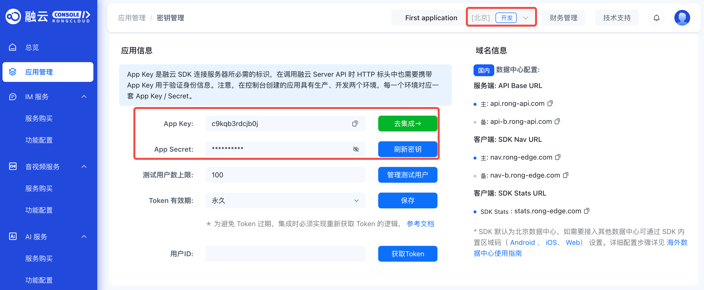
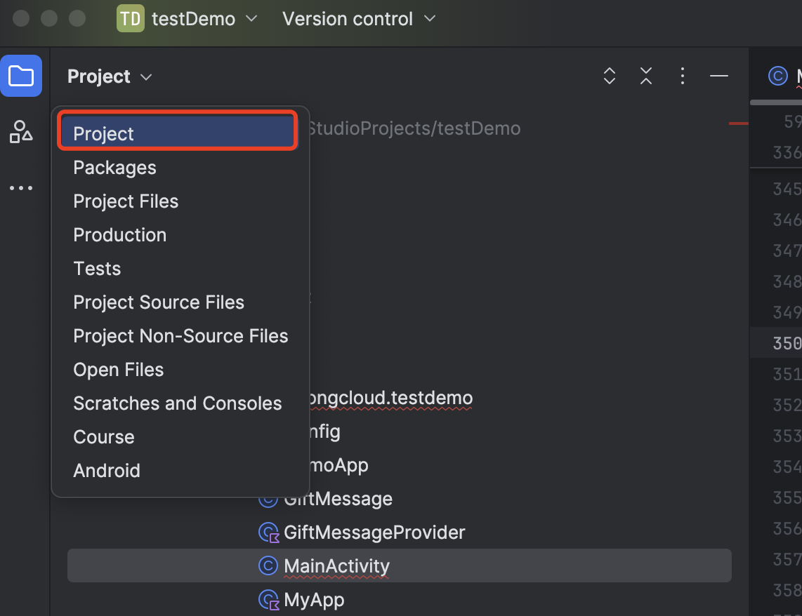

# 快速上手

本教程旨在帮助您快速了解和掌握 IMLib SDK（融云即时通讯能力库）的基础集成流程与核心通信通能力。通过本教程，您将完成从 IMLib SDK 导入、初始化、设置监听、建立连接和发送消息等全流程操作。

## 环境要求

不同 IMLib SDK 版本对 Android 系统版要求不同，具体如下：

| IMLib SDK 版本参数       | Android 系统要求    | API 级别                                                                                                       |
|------------|---------|----------------------------------------------------------------------------------------------------------|
| ≥ 5.6.3     | Android 5.0 及以上 | 21+                                                                                                |
| < 5.6.3     | Android 4.4 及以上  | 19+                                                                                                |

## 准备工作

- 访问 [融云控制台](https://console.rongcloud.cn/agile/register)注册您的开发者账号。注册成功后，控制台自动在开发环境中为创建您创建一个应用。
- 在控制台的[密钥管理](https://console.rongcloud.cn/agile/apps/km)页面，获取您的应用在开发环境的 App Key。您可在密钥管理页面查看应用的信息，如 App Key、App Secret、所属数据中心（默认为北京）。

  

- 您也可以自己创建应用，并获取对应环境 App Key 和 App Secret<!-- TODO: 链接已废弃 (https://help.rongcloud.cn/t/topic/1136) -->。

    :::tip

    每个应用均拥有两个不同的 App Key，分别对应**开发**环境与**生产**环境，且两个环境之间数据相互隔离。在您的应用正式上线前，建议切换到**生产**环境的 App Key，以便完成上线前全流程测试和最终发布。
    :::

## 操作步骤

### 导入 SDK {#import}

融云支持通过在 Gradle 中添加远程依赖和将 Android 本地库导入应用工程两种集成方式，下文以在 Gradle 中添加远程依赖为示例。

1. 打开 Android Studio，并切换到 Project 视图。
  
   
1. 在项目的根目录下，找到的 build.gradle文件，并在其中声明融云的 Maven 代码库。

    ```groovy
    allprojects {
        repositories {
            ...
            //融云 maven 仓库地址
            maven {url "https://maven.rongcloud.cn/repository/maven-releases/"}
        }
    }
    ```

3.  在 app 目录下，找到应用的 build.gradle，并将 IMLib SDK 添加为远程依赖项。下面示例中，请将 x.y.z.h 替换为 IMLib SDK 的版本号，具体版本可在前往[融云官网 SDK 下载页面](https://www.rongcloud.cn/devcenter?type=sdk)或[融云的 Maven 代码库](https://maven.rongcloud.cn/#browse/browse:maven-releases)查到。

    ```groovy
    dependencies {
    	...
    	//此处以集成 IMLib 为例
    	api 'cn.rongcloud.sdk:im_lib:x.y.z'
    }
    ```

### 初始化 IMLib SDK

为确保您可以正常连接融云服务器和使用融云即时通讯服务（IM 服务），您须调用 init 方法初始化 IMLib SDK。初始化前，您须在融云控制台中获取 App key，并设置好 InitOption（初始化配置）。

InitOption 中封装了 [AreaCode](https://doc.rongcloud.cn/apidoc/imlibcore-android/latest/zh_CN/html/-android--i-m-lib-core--s-d-k/io.rong.imlib.model/-init-option/-area-code/index.html#-495745558%2FClasslikes%2F1814687565) （数据中心的区域码），naviServer（导航服务地址）、fileServer（文件服务地址）、statisticServer（数据统计服务地址），enablePush（推送的开关）和isMainProcess（主进程开关）。详见初始化。
如果您使用北京数据中心，则不需设置 InitOption，IMLib SDK 默认连接北京数据中心。

```java
String appKey = "Your_AppKey"; // example: bos9p5rlcm2ba
InitOption initOption = new InitOption.Builder().build();

RongCoreClient.init(getApplicationContext(), appKey, initOption);
```

如果您使用海外数据中心，则须传入海外数据中心对应的 [AreaCode](https://doc.rongcloud.cn/apidoc/imlibcore-android/latest/zh_CN/html/-android--i-m-lib-core--s-d-k/io.rong.imlib.model/-init-option/-area-code/index.html#-495745558%2FClasslikes%2F1814687565) 。

```java
String appKey = "Your_AppKey";
AreaCode areaCode = AreaCode.SG; //新加坡数据中心

InitOption initOption = new InitOption.Builder()
    .setAreaCode(areaCode)
    .build();

RongCoreClient.init(context, appKey, initOption);
```

  :::tip

      如果您使用的 IMLib SDK 版本号小于 5.4.2（不含），则您须在 Application 的 onCreate() 方法中，通过调用 RongCoreClient 的init方法，并传入 App Key。详见初始化。

:::


### 监听消息

通过设置消息接收监听器，用户可接收所有类型的实时消息和离线消息。
注：为确保接收所有离线消息，请在连接 IM 融云服务器之前设置监听器。

```java
RongCoreClient.addOnReceiveMessageListener(
    new io.rong.imlib.listener.OnReceiveMessageWrapperListener() {
        @Override
        public void onReceivedMessage(Message message, ReceivedProfile profile) {
            //  针对接收离线消息时，服务端会将 200 条消息打成一个包发到客户端，客户端对这包数据进行解析。该参数表示每个数据包数据逐条上抛后，还剩余的条数
            int left = profile.getLeft();
            // 消息是否离线消息
            boolean isOffline = profile.isOffline();
            // 是否在服务端还存在未下发的消息包
            boolean hasPackage = profile.hasPackage();
        }
    }
);
```


### 连接融云 IM 服务器

1. 为模拟用户通过融云 IM 服务器收发消息，您需要首先注册一个用户。在实际业务中，应用客户端通过应用服务端调用融云 IM Server API 获取 token。详见 Server API 文档[注册用户](../platform-chat-api/user/register)。在本教程中，为了快速体验融云服务，您可在控制台「北极星」的 API 调试页面调用[获取 Token](https://console.rongcloud.cn/agile/formwork/imServerApi/index) 接口，获取到 userId 为 1 的用户的 Token。调用返回如下：

```java
HTTP/1.1 200 OK
Content-Type: application/json; charset=utf-8

{"code":200,"userId":"1","token":"gxld6GHx3t1eDxof1qtxxYrQcjkbhl1V@sgyu.cn.example.com;sgyu.cn.example.com"}
```

1. 设置连接监听器来实时获取连接状态。您可以将连接状态通过 UI 反馈给用户（例如提示 “网络连接中断” 或 “已重新连接”），提高用户体验。建议在应用生命周期内设置 IM 连接状态监听器，并在不需要的时候移除监听器。详见[连接状态监听](/android-imlib/connection/monitor-status)。

    ```java
    private IRongCoreListener.ConnectionStatusListener connectionStatusListener = new IRongCoreListener.ConnectionStatusListener() {
      @Override
      public void onChanged(ConnectionStatus status) {
            //您需要根据连接状态码，进行不同业务处理
      }
    };
    public void setIMStatusListener() {
        // 添加连接状态监听器 since 5.1.6
        RongCoreClient.addConnectionStatusListener(ConnectionStatusListener);
    }
    ```

3. 调用 connect 方法，将 userId 为 1 的用户连接融云 IM 服务。注：IMLib SDK 有重连机制，因此一个应用生命周期内调用一次 connect 即可，详见[连接](/android-imlib/connection/connect)。

    ```java
    String token = "Token";
    RongCoreClient.connect(token, new IRongCoreCallback.ConnectCallback() {
        /**
         * 数据库回调.
         * @param code 数据库打开状态. DATABASE_OPEN_SUCCESS 数据库打开成功; DATABASE_OPEN_ERROR 数据库打开失败
         */
        @Override
        public void OnDatabaseOpened(IRongCoreEnum.DatabaseOpenStatus code) {

        }
        /**
         * 成功回调
         * @param userId 当前用户 ID
         */
        @Override
        public void onSuccess(String userId) {

        }
        /**
         * 错误回调
         * @param errorCode 错误码
         */
        @Override
        public void onError(IRongCoreEnum.ConnectionErrorCode errorCode) {

        }
    });
    ```

### 发送消息

最后，您可以模拟向 userId 为 2 的用户发送一条文本消息。除了文本消息，您还可发送图片、文件、语音、文件等不同类型的消息，详见[消息类型](/android-imlib/message/send#消息内容类型简介)。

```java
String content = "您好，这是从用户1发出的消息";
String targetId = "2";
ConversationType conversationType = ConversationType.PRIVATE;
// 构建消息
TextMessage messageContent = TextMessage.obtain(content);
Message message = Message.obtain(targetId, conversationType, messageContent);

// 发送消息
RongCoreClient.getInstance().sendMessage(message, null, null, new IRongCoreCallback.ISendMessageCallback() {
    @Override
    public void onAttached(Message message) {

    }

    @Override
    public void onSuccess(Message message) {

    }

    @Override
    public void onError(Message message, IRongCoreEnum.ErrorCode errorCode) {

    }
});

```

<!-- links -->
<!-- internal -->
[初始化]: ./init.md
[导入 SDK]: ./import.md
[连接]: /android-imlib/connection/connect
[连接状态监听]: ./connection/monitor-status.md
<!-- Server API -->
[Server API 获取 Token]: /platform-chat-api/user/register
<!-- external -->
[App Key]: https://console.rongcloud.cn/agile/apps/km
[融云开发者账号]: https://console.rongcloud.cn/agile/register
[融云的 Maven 代码库]: http://maven.rongcloud.cn/#browse/browse:maven-releases
[IM Server API 调试]: https://console.rongcloud.cn/agile/formwork/imServerApi/index
[融云官网 SDK 下载页面]:https://www.rongcloud.cn/devcenter?type=sdk

