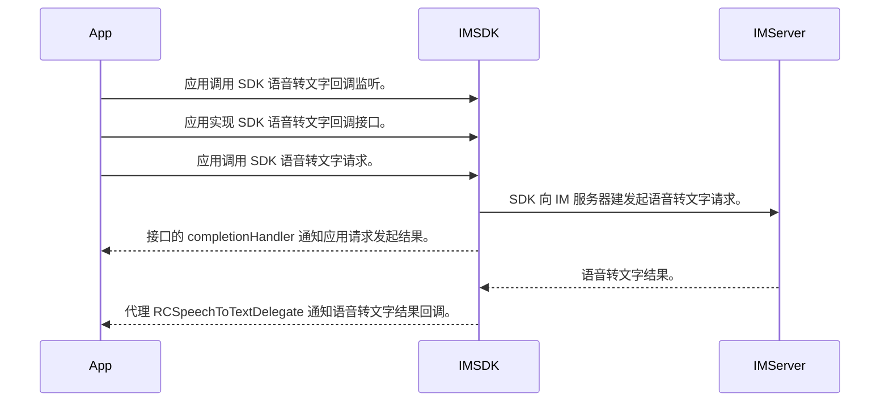

<!-- # 语音转文字 -->

本文主要描述了如何使用 IMLib SDK 将语音消息的音频转成文本。

:::tip
- 此功能从 5.22.0 版本开始支持。
- 使用前请在 IM 服务的服务购买页面开通[语音转文字功能](https://console.rongcloud.cn/agile/im/service/purchase#1702)。
:::

## 语音转文字简介 {#brief}

语音转文字的消息包括 [VoiceMessage] 和 [HQVoiceMessage]，客户端 SDK 发起语音转文字请求后，会通过事件代理回调转换结果。以下是时序图：



IMLib SDK 的 [VoiceMessage] 和 [HQVoiceMessage] 对象中，增加了语音转文字 `SpeechToTextInfo` 属性。下表是语音消息和语音转文字信息的属性，完整的属性列表可参考 API 文档。

VoiceMessage 中新增属性如下：

| 属性名 | 类型                        | 描述 |
|:---|:--------------------------|:---|
| sttInfo         | SpeechToTextInfo          | 语音转文本信息。 |

HQVoiceMessage 中新增属性如下：

| 属性名 | 类型                      | 描述 |
|:---|:------------------------|:---|
| sttInfo           | SpeechToTextInfo        | 语音转文本信息。 |
| numberOfChannels  | int                     | 声道数量 [仅单声道支持 STT 功能]。 |
| sampleRate        | int                     | 采样率 [仅 8000, 16000 支持 STT 功能]。 |
| format            | String                  | 编码格式。 |

SpeechToTextInfo 对象属性如下：

| 属性名 | 类型                        | 描述             |
|:---|:--------------------------|:---------------|
| status         | SpeechToTextStatus        | 转换状态。          |
| text            | String                    | 转换的文本内容。       |
| isVisible      | boolean                      | 是否可见，默认 false。 |

:::tip
- 高清语音消息的音频文件需要满足这些要求：声道数量为单声道，采样率是 8000 或 16000。
- 普通语音消息的 content 必须是 base64 的字符串。

:::

## 语音转文字 {#stt}

SDK 发起语音转文字请求后，结果是通过代理回调的方式通知给应用。

### 添加语音转文字结果代理

应用可以通过 `addSpeechToTextListener` 方法设置语音转文字回调代理。

#### 示例代码

```java
RongCoreClient.getInstance().addSpeechToTextListener(IRongCoreListener.SpeechToTextListener listener);
```

### 实现语音转文字代理方法

语音转文字结束后，应用程序会收到 `SpeechToTextListener` 的 `onSpeechToTextComplete` 回调。

#### 参数说明

| 参数             | 类型               | 说明     |
|:-----------------|:-----------------|:--------------------|
| info         | SpeechToTextInfo | 语音转文字信息。 |
| messageUId   | String           | 消息唯一 ID。 |
| code         | ErrorCode        | 错误码。 |

#### 示例代码

```java
@Override
public void onSpeechToTextComplete(SpeechToTextInfo info, String messageUId, IRongCoreEnum.CoreErrorCode coreErrorCode) {
}
```

### 发起语音转换文本请求 {#request}

您可以调用 `requestSpeechToTextForMessage:completionHandler:` 方法，发起语音转文字请求。

#### 参数说明

| 参数         | 类型                 | 说明                    |
|:-----------|:-------------------|:-----------|
| messageUId | String             | 消息唯一 ID。         |
| callback   | IRongCoreCallback.OperationCallback              | 结果回调。       |

#### 示例代码

```objectivec
RongCoreClient.getInstance().requestSpeechToTextForMessage("messageUId", new IRongCoreCallback.OperationCallback() {
    @Override
    public void onSuccess() {
    }
    
    @Override
    public void onError(IRongCoreEnum.CoreErrorCode coreErrorCode) {
    }
});
```

### 设置语音转换文本功能的可见性 {#visible}

您通过 `setMessageSpeechToTextVisible:isVisible:completionHandler:` 控制语音转文本的可见性。

#### 参数说明

| 参数             | 类型    | 说明                    |
|:-----------------|:------|:-----------|
| messageId         | int   | 消息本地 ID。         |
| isVisible         | boolean  | 是否可见。         |
| callback  | IRongCoreCallback.OperationCallback | 结果回调。       |

#### 示例代码

```objectivec
RongCoreClient.getInstance().setMessageSpeechToTextVisible(124, true, new IRongCoreCallback.OperationCallback() {
    @Override
    public void onSuccess() {
    }
    
    @Override
    public void onError(IRongCoreEnum.CoreErrorCode coreErrorCode) {
    }
});
```

<!-- links -->
[Message]: https://doc.rongcloud.cn/apidoc/imlibcore-android/latest/zh_CN/html/-android--i-m-lib-core--s-d-k/io.rong.imlib.model/-message/index.html
[MessageContent]: https://doc.rongcloud.cn/apidoc/imlibcore-android/latest/zh_CN/html/-android--i-m-lib-core--s-d-k/io.rong.imlib.model/-message-content/index.html
[VoiceMessage]: https://doc.rongcloud.cn/apidoc/imlibcore-android/latest/zh_CN/html/-android--i-m-lib-core--s-d-k/io.rong.message/-voice-message/index.html
[HQVoiceMessage]: https://doc.rongcloud.cn/apidoc/imlibcore-android/latest/zh_CN/html/-android--i-m-lib-core--s-d-k/io.rong.message/-h-q-voice-message/index.html
[SpeechToTextInfo]: https://doc.rongcloud.cn/apidoc/imlibcore-ios/latest/zh_CN/documentation/rongimlibcore/rcspeechtotextinfo?language=objc
[获取历史消息]: ./message/get-history.md
[消息扩展]: ./message/expansion.md
