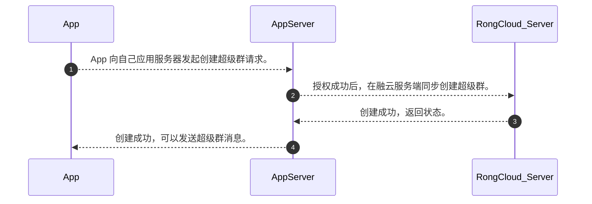
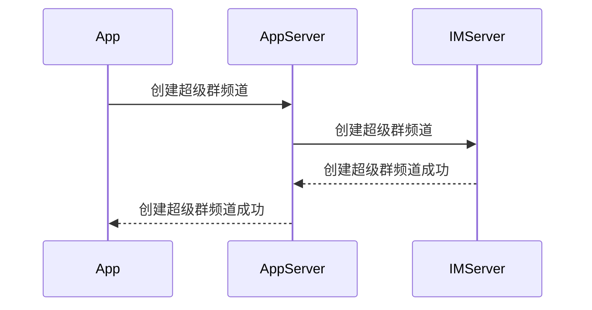

# 创建超级群与频道

IMLib SDK 不提供创建超级群与创建群频道的接口。请使用融云服务端 API（Server API）的相关接口创建超级群、群频道或进行其他管理操作。

:::tip

 单个用户最多可以加入 100 个超级群。单个用户在每个群中最多可以加入或者创建 50 个频道。
:::

本文仅简单介绍创建超级群与创建频道的基本流程。

## 创建超级群

创建超级群必须使用融云服务端 API（Server API），具体接口使用方法请参见服务端文档[创建超级群](/platform-chat-api/ultragroup/create-ultragroup)。

### 基本流程

1. App 客户端请求 App 服务端（AppServer）创建超级群。
1. App 服务端调用融云 Server API 接口创建超级群，群组 ID 由 App 服务器自行生成
1. 超级群创建成功后，由 App 服务端返回给 App 客户端。

### 如何处理与展示超级群列表

AppServer 需要保存当前用户的超级群列表，并下发给 App，然后进行展示。

>考虑到 App 由于自身业务需求，需要知晓当前用户的超级群列表（例如用户所在的超级群有等级权重等排序规则），而融云的超级群列表是通过消息产生的，因而两个列表可能不完全一样，建议由 App 按照自身业务保存用户的超级群列表。

## 创建群频道

创建超级群必须使用融云服务端 API（Server API），具体接口使用方法请参见服务端文档[创建频道](/platform-chat-api/ultragroup/create-channel)。

### 基本流程

### 如何处理与展示超级群频道列表

为方便在同一超级群下的不同用户按需看到自己需要的列表（例如用户对特定频道标星需要特别展示，APP 服务则需要按用户记录），APP 服务应采取更为灵活的方式维护超级群的频道列表。

APP 服务端也可以按照需求将超级群分组（如**超级群概述**中的 UI 框架设计所示）。

