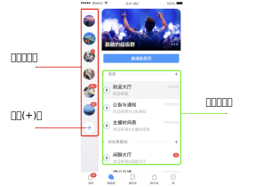

# 超级群概述

> - 客户端 IMLib SDK 从 SDK 5.2.0 开始支持超级群。IMKit 暂不支持超级群业务。
> - 除部分接口另有说明外，超级群 Android 客户端接口大部分均在 [ChannelClient](https://doc.rongcloud.cn/apidoc/imlibcore-android/latest/zh_CN/html/-android--i-m-lib-core--s-d-k/io.rong.imlib/-channel-client/index.html) 中。

融云超级群（UltraGroup）提供了一种新的群组业务形态。超级群不设置群成员人数上限，允许用户在超级社群中建立社交关系、在海量信息中聚焦自己感兴趣的内容，帮助开发者打造高用户黏性的群体。超级群组成员最多可加入 100 个超级群，每个超级群下的不同频道之间共享一份超级群成员关系。App 内的超级群数量没有限制。

超级群业务的会话类型（`ConversationType`）为 `ConversationType.ULTRA_GROUP`，用 `targetId` 表示超级群 ID，`channelId` 表示超级群频道 ID。除部分接口另有说明外，超级群 Android 客户端接口大部分均在 [ChannelClient](https://doc.rongcloud.cn/apidoc/imlibcore-android/latest/zh_CN/html/-android--i-m-lib-core--s-d-k/io.rong.imlib/-channel-client/index.html) 中。

## 开通服务

超级群功能需要在控制台[超级群服务](https://console.rongcloud.cn/agile/im/service/config#%E8%B6%85%E7%BA%A7%E7%BE%A4)页面开通。

* 仅 **IM 尊享版**支持开通超级群服务。
<!-- * 配置介绍详见开通与配置超级群服务 TODO: 链接已废弃 (https://help.rongcloud.cn/t/topic/1057) -->。
* 具体功能与费用以[融云官方价格说明](https://www.rongcloud.cn/pricing)页面及[计费说明](https://help.rongcloud.cn/t/topic/123)文档为准。

## 如何使用频道

超级群支持在群会话中创建独立的频道（客户端由 `channelId` 指定、对应服务端的 `busChannel`），超级群的会话、消息、未读数等消息数据和群组成员支持分频道进行聚合，各个频道之间消息独立。

频道按类型区分为公有频道与私有频道。公有频道对所有超级群成员开放（无需加入）。该超级群的所有成员都会接收公有频道下的消息。私有频道仅对该频道成员列表上的用户开放。有关私有频道的详细介绍，可参见[超级群私有频道概述](./private-channel-about.md)。

超级群业务提供一个 ID 为 `RCDefault` 的默认频道。`RCDefault` 频道对所有超级群成员开放，不可转为私有频道。

对于 App 业务来说，如果仅需实现类似群聊的业务，可以利用超级群无成员上限的特性构建大于 3000 人的超大群。这种场景下，可以让所有消息都在 `RCDefault` 默认频道中进行收发。建议在调用客户端、服务端 API 时指定频道 ID 为 `RCDefault`。

如果仅需实现类似 Discord 类业务，通过超级群频道功能构建子社区，推荐全部使用您自行创建的频道实现您的业务特性。默认频道（`RCDefault`）与自建频道的行为存在差异，全部使用自建频道可避免这种差异在实现 App 业务逻辑时造成限制。

:::tip

 如果您的 App / 环境在 2022.10.13 日之前开通超级群服务，则您的超级群服务中不存在 `RCDefault` 频道。在调用客户端、服务端 API 时如果不指定频道 ID，一般仅作用于不属于任何频道的消息，具体行为需参见各功能文档。融云支持客户调整服务至最新行为。该行为调整将影响客户端、服务端收发消息、获取会话、清除历史消息、禁言等多个功能。如有需要，请提交工单咨询详细方案。
:::

## 客户端 UI 框架参考设计

超级群产品暂不提供 UI 组件。您可以参考以下 UI 框架设计了解超级群 App 的设计思路。

- 下图左侧红框中为超级群列表，即当前登录用户的超级群列表。红框底部的加号（+）按钮代表新建超级群。
- 上图绿框中为超级群频道（Channel）列表。超级群的每一个频道由频道 ID（`channelId`）指定。

## 超级群管理接口

超级群不具备群组数据信息托管能力，超级群的业务逻辑全部需要在 App 服务器进行实现。

对于客户端开发人员来说，创建群组、频道等基础管理操作只需要与 App 服务端交互即可。App 服务端需要调用相应的融云服务端 API（Server API）接口相关接口创建超级群、创建频道等其他管理操作。

下表列出了融云提供的超级群基础管理接口。

:::tip

 Server API 还提供超级群全体禁言、超级群用户禁言等更多管理接口。具体请参见[融云服务端超级群文档]。
:::

| 功能分类                   | 功能描述                                                                                     | 客户端 API   | 融云服务端 API                        |
|:-----------------------|:-----------------------------------------------------------------------------------------|:----------|:---------------------------------|
| 创建、解散超级群            | 提供创建者用户 ID、超级群 ID、和群名称，向融云服务端申请建群。如解散超级群，则群成员关系不复存在。 | 不提供该 API | [创建超级群]、[解散超级群]             |
| 加入、退出超级群            | 加入超级群后，默认可查看入群以后产生的新消息。退出超级群后，不再接受该群的新消息。               | 不提供该 API | [加入超级群]、[退出超级群]             |
| 修改融云服务端的超级群信息 | 修改在融云推送服务中使用的超级群信息。                                                        | 不提供该 API | [更新超级群信息]                      |
| 创建、删除群频道            | 在超级群会话中创建独立沟通的频道。如删除频道，将无法在频道中发送消息。                          | 不提供该 API | [创建频道]、[删除频道]                 |
| 查询群频道列表             | 加入超级群后，默认可查看入群以后产生的新消息。退出超级群后，不再接受该群的新消息。               | 不提供该 API | [查询频道列表]                        |
| 变更群频道类型             | 超级群频道可以随时切换为公有频道或私有频道。                                                  | 不提供该 API | [变更频道类型]                        |
| 添加、删除私有频道成员      | 将超级群成员加入或移出指定频道的私有频道成员列表。在频道类型为私有频道时启用该成员列表的数据。 | 不提供该 API | [添加私有频道成员]、[删除私有频道成员] |

<!-- 链接区域 -->
[融云服务端超级群文档]: /platform-chat-api/ultragroup/overview
<!-- Server API -->
[创建超级群]: /platform-chat-api/ultragroup/create-ultragroup
[解散超级群]: /platform-chat-api/ultragroup/dismiss-ultragroup
[加入超级群]: /platform-chat-api/ultragroup/join-ultragroup
[退出超级群]: /platform-chat-api/ultragroup/quit-ultragroup
[更新超级群信息]: /platform-chat-api/ultragroup/refresh-ultragroup-info
[创建频道]: /platform-chat-api/ultragroup/create-channel
[删除频道]: /platform-chat-api/ultragroup/delete-channel
[查询频道列表]: /platform-chat-api/ultragroup/get-channel-list
[变更频道类型]: /platform-chat-api/ultragroup/change-channel-type
[添加私有频道成员]: /platform-chat-api/ultragroup/private-channel/add-to-private-channel-users
[删除私有频道成员]: /platform-chat-api/ultragroup/private-channel/delete-from-private-channel-users

