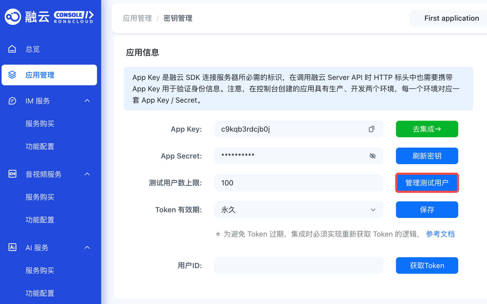

# 用户概述

您的用户需要接入融云服务，才能使用即时通讯（IM）功能。在融云的体系中，"用户"指持有有效 Token 并成功连接融云 IM 服务的应用用户。

## 注册用户

您需要通过应用服务器（App Server），使用您用户的 `userId` 调用融云的[注册用户]接口，来换取唯一的用户身份凭证（Token）。这一步骤必须通过服务端 API 完成。

应用客户端在连接融云 IM 服务端时，必须携带此 Token 作为凭证。融云会验证 Token 的有效性，以确保连接安全。

**注册用户数限制**

- 在**开发环境**<a href="/guides/glossary/imglossary#dev">?</a>中，注册用户数上限为 100。
- 在**生产环境**<a href="/guides/glossary/imglossary#prod">?</a>中，升级为 **IM 旗舰版**或 **IM 尊享版**后，注册用户数无限制。

## 删除用户 {#delete}

您可以在应用的**开发环境**下，通过控制台删除已注册的测试用户，以管理测试用户数量。**生产环境**不支持此操作。

## 注销用户

注销用户是指在融云服务中删除用户数据。您的应用可通过服务端[注销用户 API](/platform-chat-api/user/deactivation/deactivate) 使用该功能，实现用户销户，以满足应用上架或合规要求。

:::tip
注销用户的能力仅通过服务端 API 提供。
:::

注销成功后，与该 `userId` 相关的数据将被删除。您可以查询所有已注销的 `userId`。如有需要，您也可以重新激活已被注销的 `userId`，但请注意，用户相关的个人数据无法恢复。

## 用户信息

用户信息泛指用户的昵称、头像、群昵称、群头像等数据。默认情况下，融云不存储和维护您应用的用户信息，您需要在自己的服务器上管理这些数据。

如果您希望将用户信息交由融云管理，可以使用融云已默认开通的[用户信息托管]服务。

## 好友关系

默认情况下，融云 IM 服务不保存您应用用户的好友关系数据，也不干预用户的好友关系逻辑。您的应用服务器（App Server）须自行维护用户好友关系。如您希望通过融云管理好友关系，可使用已默认开通的[用户信息托管]服务，该服务提供了好友关系管理功能。

如使用好友关系服务，默认非好友间也可以互发消息。如需限制为仅好友可互发单聊消息，可在控制台的`开发者 > 信息托管服务 > 功能设置`中开启此功能。

在不使用融云提供的好友关系管理服务时，如果您需要限制用户间的消息收发行为（例如，防止由于`userId` 泄漏，恶意用户越过好友关系向其他用户发送骚扰消息），可以使用[用户白名单]服务。开启白名单后，用户将仅能接收来自其白名单中用户的消息。

## 用户管理接口

| 功能分类 | 功能描述 | 客户端 API | 服务端 API |
|:---|:---|:---|:---|
| 注册用户 | 为您的用户获取 Token。 | 不提供 | [注册用户] |
| 删除用户 | 参见上文[删除用户](#delete)。 | 不提供 | 不提供 |
| 作废 Token | 废弃指定时间点前获取的 Token。 | 不提供 | [作废 Token] |
| 注销用户 | 在融云服务中停用用户 ID 并删除其个人数据。 | 不提供 | [注销用户] |
| 查询已注销用户 | 获取已注销的用户 ID 列表。 | 不提供 | [查询已注销用户] |
| 重新激活用户 | 重新启用已注销的用户 ID。 | 不提供 | [重新激活用户 ID] |
| 设置融云服务端的用户信息 | 设置用户名称与头像，用于推送等服务。 | 不提供 | [修改用户信息] |
| 获取融云服务端的用户信息 | 获取用户在融云注册的信息（包括用户的创建时间、和用于推送的用户名称、头像 URL）。 | 不提供 | [获取信息] |
| 修改融云服务端的用户信息 | 修改用于推送的用户名称与头像。 | 不提供 | [修改信息] |
| 封禁用户 | 禁止用户连接融云 IM 服务，立即生效。可设置封禁时长，支持主动解封及查询被封禁用户的用户 ID、封禁结束时间。 | 不提供 | [添加封禁用户]、[解除封禁用户]、[查询封禁用户] |
| 查询用户在线状态 | 查询指定用户的在线状态。 | 不提供 | [查询在线状态] |
| 加入黑名单 | 将指定用户加入黑名单。在 A 用户黑名单中的用户无法向 A 发送消息。 | [加入黑名单][sdk-add-to-blacklist] | [加入黑名单][server-api-add-to-blacklist] |
| 移出黑名单 | 将指定用户从黑名单中移除。 | [移出黑名单][sdk-remove-from-blacklist] | [移出黑名单][server-api-remove-from-blacklist] |
| 查询用户是否在黑名单中 | 检查指定用户是否在当前用户的黑名单中。 | [查询用户是否在黑名单中] | 不提供 |
| 获取黑名单列表 | 获取当前用户的黑名单列表。 | [获取黑名单列表] | [查询黑名单] |
| 用户白名单 | 开启后，用户仅能接收来自其白名单中用户的消息。 | 不提供 | [开启用户白名单]、[用户白名单状态查询]、[添加白名单]、[移出白名单]、[查询白名单] |

<!-- 链接区域 -->
<!-- Server API -->
[注册用户]: /platform-chat-api/user/register
[修改用户信息]: /platform-chat-api/user/modify
[作废 Token]: /platform-chat-api/user/expire
[注销用户]: /platform-chat-api/user/deactivation/deactivate
[查询已注销用户]: /platform-chat-api/user/deactivation/query-deactivated-list
[重新激活用户 ID]: /platform-chat-api/user/deactivation/reactivate
[获取信息]: /platform-chat-api/user/get
[修改信息]: /platform-chat-api/user/modify
[添加封禁用户]: /platform-chat-api/user/block
[解除封禁用户]: /platform-chat-api/user/unblock
[查询封禁用户]: /platform-chat-api/user/query-blocked-list
[查询在线状态]: /platform-chat-api/user/check-online-status-by-user
<!-- Server API 加入黑名单-->
[server-api-add-to-blacklist]: /platform-chat-api/user/blacklist/add-to-blacklist
<!-- Server API 移出黑名单-->
[server-api-remove-from-blacklist]: /platform-chat-api/user/blacklist/remove-from-blacklist
[查询黑名单]: /platform-chat-api/user/blacklist/query-blacklist
[用户白名单]: /platform-chat-api/user/whitelist/whitelist-about
[用户信息托管]: /android-imlib/user/user_profiles
[开启用户白名单]: /platform-chat-api/user/whitelist/query-whitelist-service
[用户白名单状态查询]: /platform-chat-api/user/whitelist/query-whitelist-service
[添加白名单]: /platform-chat-api/user/whitelist/add-to-whitelist
[移出白名单]: /platform-chat-api/user/whitelist/remove-from-whitelist
[查询白名单]: /platform-chat-api/user/whitelist/query-whitelist
<!-- 客户端 SDK IMLib -->
<!-- SDK 加入黑名单-->
[sdk-add-to-blacklist]: ./blacklist.md#add
<!-- SDK 移出黑名单-->
[sdk-remove-from-blacklist]: ./blacklist.md#remove
[查询用户是否在黑名单中]: ./blacklist.md#lookup
[获取黑名单列表]: ./blacklist.md#get

<!--
|添加封禁用户| 立即断开连接，并禁止用户连接到融云即时通讯服务，直至解封。 | 不提供该 API | [添加封禁用户] |
|解除封禁用户| 主动解除对用户的封禁。 | 不提供该 API | [解除封禁用户] |
|查询封禁用户| 查询被封禁用户的用户 ID、封禁结束时间。 | 不提供该 API | [查询封禁用户] | -->

