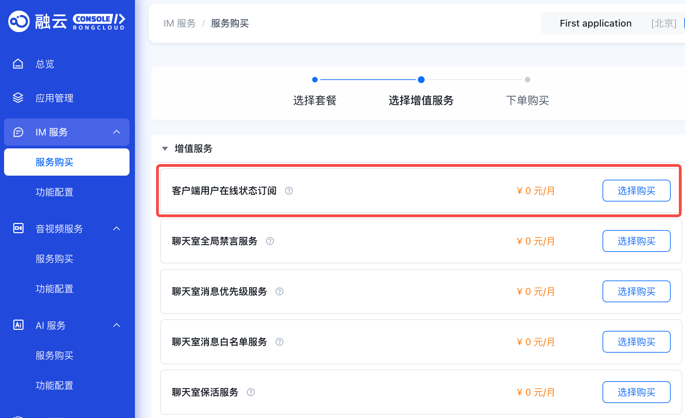

本文档旨在指导开发者如何在融云即时通讯 Android 客户端 SDK 中实现用户在线状态的订阅、查询和监听。通过本文档， Android 开发者将了解如何获取和跟踪用户在线状态，以及如何在状态变更时接收通知。

:::tip
此功能在 5.8.1 版本开始支持。
:::

<!--public-cloud-only start-->
## 开通服务

您可以通过融云控制台 IM 服务的[服务购买](https://console.rongcloud.cn/agile/im/service/purchase#1407)页面开通**客户端用户在线状态订阅**服务。


<!--public-cloud-only end-->


## 监听订阅事件

为了及时接收订阅事件的变更通知，你需要在应用调用 IMLib SDK 的初始化之后，且在调用 IMLib SDK 的连接之前，设置订阅在线状态监听器。

您在处理订阅事件变更的通知时，需要根据回调方法中的 `SubscribeType` 的类型来处理对应的业务。在线订阅状态的类型为 `ONLINE_STATUS`。
:::tip
- 从5.10.0版本开始，`SubscribeType` 包含了在线状态订阅 `ONLINE_STATUS(1)`、用户信息托管 `USER_PROFILE(2)` 这2种类型。
- 从5.12.0版本开始，`SubscribeType` 新增了好友在线状态订阅 `FRIEND_ONLINE_STATUS(3)`、好友用户信息托管 `FRIEND_USER_PROFILE(4)` 这2种类型。
:::

```java
RongCoreClient.getInstance().addSubscribeEventListener(new OnSubscribeEventListener() {
    /**
     * @param subscribeEvents 订阅事件的列表，包含所有发生变化的事件。
     * 被订阅者发生状态变更时，SubscribeEvent.operationType 无值。
     * 订阅过期没有通知， 开发者需自行关注过期时间。
     * 注意：需要判断 SubscribeInfoEvent 的 SubscribeType， 等于 ONLINE_STATUS 时代表在线状态。
     */
    @Override
    public void onEventChange(List<SubscribeInfoEvent> subscribeEvents) {

    }

    /**
     * 订阅数据同步完成。
     * 该方法在订阅数据成功同步到设备或系统后调用，用于执行后续处理。
     * @deprecated 已废弃。请使用 {@link #onSubscriptionSyncCompleted(SubscribeEvent.SubscribeType)}
     */
    @Override
    public void onSubscriptionSyncCompleted() {

    }

    /**
     * 标记订阅数据同步完成。 该方法在订阅数据成功同步到设备或系统后调用，用于执行后续处理。
     * 注意：需要判断 SubscribeType， 等于 ONLINE_STATUS 时代表在线状态
     *
     * @param type 同步完成的类型。需要通过根据类型来判断具体是哪种业务同步完成。
     * @since 5.10.0
     */
    @Override
    public void onSubscriptionSyncCompleted(SubscribeEvent.SubscribeType type) {

    }

    /**
     * 当用户在其他设备上的订阅信息发生变更时调用此方法。
     * 这可以用于更新当前设备上的用户状态，确保订阅信息的一致性。
     * 注意：需要判断 SubscribeInfoEvent 的 SubscribeType， 等于 ONLINE_STATUS 时代表在线状态。
     * @param subscribeEvents 订阅事件的列表
     */
    @Override
    public void onSubscriptionChangedOnOtherDevices(List<SubscribeEvent> subscribeEvents) {

    }
});
```


## 订阅用户在线状态

为了跟踪特定用户的在线状态， 您需要使用 `subscribeEvent` 方法进行订阅。

1. 您需要创建订阅请求对象 `SubscribeEventRequest`，设置订阅类型为订阅在线状态 `SubscribeEvent.SubscribeType.ONLINE_STATUS`， 并设置好需要订阅的所有用户的 userId 列表和订阅时长。

:::tip
- 单次订阅的用户的上限为 200 个用户。
- 总订阅上限为 1000 个用户。
- 设置订阅时间：定义一个整数值，该值表示订阅的持续时间，订阅时长的范围为 60 秒到 2592000 秒。
- 单个用户最多可被 5000 个用户订阅。
:::

**示例代码**

```java
//设置订阅类型。
SubscribeEvent.SubscribeType type= SubscribeEvent.SubscribeType.ONLINE_STATUS;
//设置订阅时间，取值范围为[60,2592000]（单位:秒）。
int expiry=180000;
//订阅用户userId，即单聊的 targetId (一次最多订阅 200 个)。
List<String> userList=new ArrayList<>();
userList.add("user1");
userList.add("user2");
userList.add("user3");
SubscribeEventRequest request = new SubscribeEventRequest(type,expiry,userList);
RongCoreClient.getInstance().subscribeEvent(request, new IRongCoreCallback.SubscribeEventCallback<List<String>>() {
    @Override
    public void onSuccess() {
        //订阅成功。
    }

    @Override
    public void onError(int errorCode, List<String> strings) {
        //订阅失败。
    }
});
```

### 批量查询已订阅用户的在线状态

批量查询已订阅用户的在线状态。 开通`客户端好友在线状态变更通知`功能后，支持查询当前用户指定好友的当前在线状态。

:::tip
此功能在 5.28.0 版本开始支持。
:::

```java
List<String> userIds = new ArrayList<>();
userIds.add("user1");
userIds.add("user2");
userIds.add("user3");

RongCoreClient.getInstance().getSubscribeUsersOnlineStatus(userIds, new IRongCoreCallback.ResultCallback<List<SubscribeUserOnlineStatus>>() {
    @Override
    public void onSuccess(List<SubscribeUserOnlineStatus> subscribeUserOnlineStatuses) {

    }

    @Override
    public void onError(IRongCoreEnum.CoreErrorCode e) {

    }
});

```


### 取消订阅用户在线状态

当您不再需要跟踪用户的在线状态时，可以使用 `unSubscribeEvent` 方法取消订阅。


```java
//设置取消订阅的类型。
SubscribeEvent.SubscribeType type= SubscribeEvent.SubscribeType.ONLINE_STATUS;
//取消订阅用户userId，即单聊的 targetId，一次最多取消订阅 200 个。
List<String> userList=new ArrayList<>();
userList.add("user1");
userList.add("user2");
userList.add("user3");
SubscribeEventRequest request = new SubscribeEventRequest(type,userList);
RongCoreClient.getInstance().unSubscribeEvent(request, new IRongCoreCallback.SubscribeEventCallback<List<String>>() {
    @Override
    public void onSuccess() {
        //取消订阅成功。
    }

    @Override
    public void onError(int errorCode, List<String> strings) {
        //取消订阅失败。
    }
});

```

### 查询指定用户订阅状态信息

您可以使用 `querySubscribeEvent` 方法查询指定用户和订阅类型的状态信息。一次最多查询200个用户的状态信息。


```java
//设置查询类型。
SubscribeEvent.SubscribeType type= SubscribeEvent.SubscribeType.ONLINE_STATUS;
//查询用户在线状态。
List<String> userList=new ArrayList<>();
userList.add("user1");
userList.add("user2");
userList.add("user3");
SubscribeEventRequest request = new SubscribeEventRequest(type,userList);
RongCoreClient.getInstance().querySubscribeEvent(request, new IRongCoreCallback.ResultCallback<List<SubscribeInfoEvent>>() {
    @Override
    public void onSuccess(List<SubscribeInfoEvent> subscribeInfoEvents) {
        //查询成功，返回查询用户信息。
    }

    @Override
    public void onError(IRongCoreEnum.CoreErrorCode e) {
        //查询失败。
    }
});
```

### 分页查询已订阅用户的状态信息

如果您需要分页获取已订阅的所有事件状态信息，可以使用 `querySubscribeEvent` 方法，并指定分页大小和起始索引。

- Parameter pageSize: 分页大小[1~200]。
- Parameter startIndex: 第一页传 0， 下一页取返回所有数据的数组数量（比如 pageSize = 20，第二页传 20，第三页传40）。

```java
//查询类型
SubscribeEvent.SubscribeType type= SubscribeEvent.SubscribeType.ONLINE_STATUS;
SubscribeEventRequest request = new SubscribeEventRequest(type);
//分页大小，取值范围为[1,200]。
int pageSize=20;
//分页起始索引，第一页传 0， 下一页取返回所有数据的数组数量，比如 pageSize = 20，则第二页传 20，第三页传 40。
int startIndex=0;
RongCoreClient.getInstance().querySubscribeEvent(request,pageSize,startIndex, new IRongCoreCallback.ResultCallback<List<SubscribeInfoEvent>>() {
    @Override
    public void onSuccess(List<SubscribeInfoEvent> subscribeInfoEvents) {
        //查询成功，返回查询用户信息。
    }

    @Override
    public void onError(IRongCoreEnum.CoreErrorCode e) {
        //查询失败。
    }
});
```
